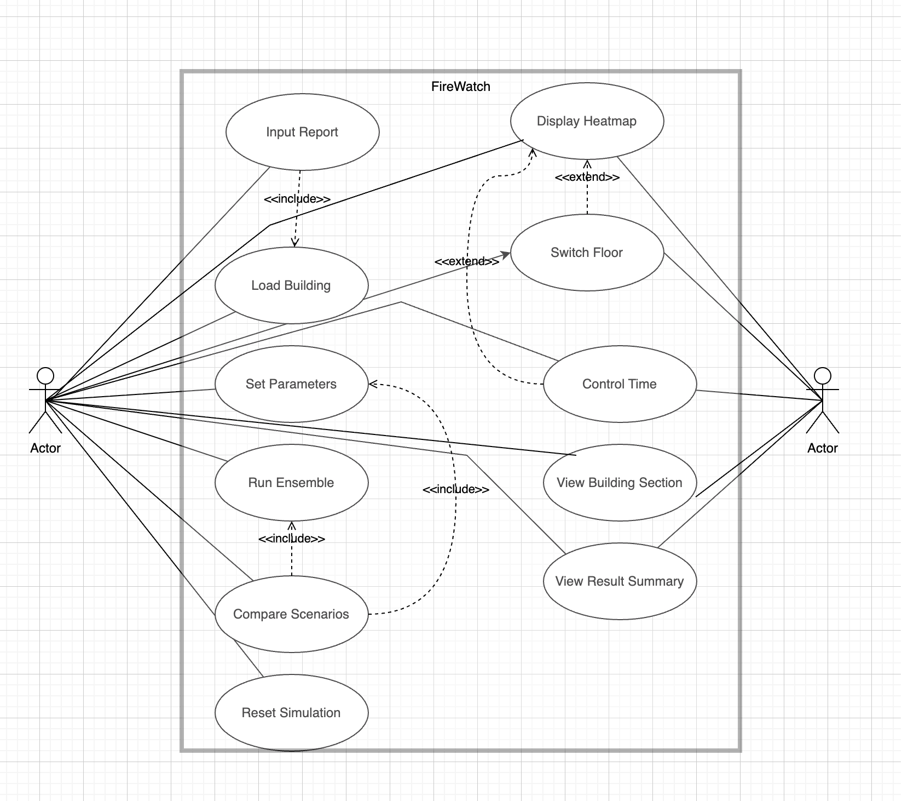

# FireWatch

### 소방 작전 의사결정 지원을 위한 셀룰러 오토마타 기반 건물 화재 확산 시뮬레이션 시스템

**Analysis Document**

* **학번:** 22012106
* **이름:** 이승민
* **E-mail:** dinola@naver.com
* **깃허브 주소** : https://github.com/dinnow123/FireWatch

## Revision History

| Revision date | Version # | Description | Author |
| --- | --- | --- | --- |
| 2026.05.07 | 0.1 | First Analysis Document | 이승민 |

## Contents

1. Introduction
2. Use case modeling
3. Domain analysis
4. UI prototype
5. Glossary
6. References

---

## 1. Introduction

본 문서는 Conceptualization Document의 다음 단계인 Analysis 단계의 산출물로, FireWatch 시스템에 대한 두 번째 문서이다.

### 1.1. Executive Summary

화재는 발생 직후 매우 빠르게 확산되며, 초기 대응 단계에서의 의사결정이 인명 및 재산 피해 규모를 결정짓는 핵심 요소로 작용한다. 특히 신고 접수 이후 현장 도착까지의 짧은 시간 동안, 진입 경로 선정과 우선 구조 구역 판단은 구조 활동의 성패를 좌우한다.

그러나 현재 화재 관제 환경에서는 신고자의 제한적인 진술과 정적인 평면도에 주로 의존하고 있으며, 화재의 확산 방향이나 속도에 대한 정량적인 예측 정보는 제공되지 않는다. 이로 인해 관제관은 경험과 직관에 의존한 판단을 수행하게 되며, 이는 상황에 따라 대응의 일관성과 정확성이 저하되는 문제를 야기한다.

또한 다층 건물의 경우 계단, 엘리베이터, 환기 구조 등에 의해 화재가 수직 방향으로 빠르게 확산되는 특성이 있으며, 특정 층이 단시간 내에 고위험 구역으로 전환될 수 있다. 이러한 특성을 사전에 예측하지 못할 경우, 구조 인력의 진입 경로 선택이 비효율적이거나 위험한 결과로 이어질 가능성이 존재한다.

기존의 대표적인 화재 시뮬레이션 도구인 NIST의 FDS(Fire Dynamics Simulator)는 Navier-Stokes 방정식 기반의 CFD(Computational Fluid Dynamics) 모델과 LES(Large Eddy Simulation)를 활용하여 화재 동역학을 정밀하게 재현할 수 있다. 그러나 이러한 방식은 높은 계산 비용을 요구하며, 단일 워크스테이션 기준 수 시간에서 수 일에 이르는 연산 시간이 필요하다. 이로 인해 신고 접수 직후의 실시간 의사결정 지원 도구로 활용하기에는 현실적인 제약이 존재한다. 또한 단일 시뮬레이션 결과만을 제공하기 때문에 실제 화재가 가지는 다양한 불확실성을 충분히 반영하지 못한다는 한계도 있다.

이러한 한계를 보완하기 위해 본 프로젝트에서는 FireWatch 시스템을 제안한다. FireWatch는 확률적 셀룰러 오토마타 기반의 앙상블 시뮬레이션을 활용하여, 동일한 조건에서 다수의 시뮬레이션을 수행하고 그 결과를 종합함으로써 각 구역별 화재 도달 확률을 산출한다. 이를 통해 단일 결과가 아닌 확률 분포 형태의 예측을 제공하며, 사용자는 위험도가 높은 구역을 직관적으로 식별할 수 있다.

또한 FireWatch는 건물 구조, 셀별 재질 정보, 소방 설비 데이터를 분리하여 관리함으로써 새로운 건물의 추가 및 기존 데이터 갱신이 용이하도록 설계된다. 더 나아가 향후 IoT 기반 센서 데이터(온도, 연기 등)를 연동하여 시뮬레이션 결과를 실시간으로 보정하는 데이터 어시밀레이션 기반 시스템으로 확장할 수 있으며, 연기 확산이나 유독가스 분석과 같은 추가 모델 통합도 가능하다.

결과적으로 FireWatch는 기존 시스템이 제공하지 못했던 신속성, 확률 기반 의사결정, 그리고 확장 가능성을 동시에 확보함으로써, 화재 대응 과정 전반의 의사결정 품질을 향상시키는 것을 목표로 한다.

### 1.2. Business Goals

FireWatch 시스템의 주요 목표는 다음과 같다.

* 화재 신고 직후 수 초에서 수 분 이내에 확산 예측 결과를 제공하여 초기 대응 의사결정 속도를 향상시킨다.
* 확률 기반 시뮬레이션을 통해 화재 확산의 불확실성을 반영하고, 위험 구역을 정량적으로 식별할 수 있도록 한다.
* 관제관과 현장요원이 동일한 정보를 공유하여 상황 인식의 차이를 줄이고 협업 효율을 향상시킨다.
* 소방 설비 작동 여부 등에 따른 다양한 시나리오 비교를 통해 최적의 대응 전략 수립을 지원한다.

---

## 2. Use case modeling

### 2.1. Use case diagram

Conceptualization 단계의 System context diagram과 Use case list를 참조하여 Use case diagram을 다음과 같이 작성하였다. 모델링 도구는 StarUML을 사용하였으며, 액터(Commander, Field Operator)와 11개의 Use Case 사이의 관계를 나타내었다.

Actor와 상호작용하는 Use Case들은 Association으로 연결하였고, 한 Use Case의 본체 로직 안에서 반드시 호출되는 Use Case는 «include»로, 본체 화면 상에서 조건부로 분기되는 Use Case는 «extend»로 관계를 표시하였다. 시간적 선행 관계는 다이어그램이 아닌 각 Use Case의 Preconditions에서 처리하였다.

---

### 2.2. Use case description

앞에서 식별한 11개의 Use Case에 대해 차례대로 Description을 표로 정리한다. 각 Use Case의 일반 정보, 주 흐름(Main Success Scenario), 분기 흐름(Extension Scenarios), 관련 정보를 통합 형식으로 기술한다.

#### 2.2.1. Input Report

| **Use Case #1 : Input Report** | |
|---|---|
| **GENERAL CHARACTERISTICS** | |
| Summary | 관제관이 화재 신고 정보를 시스템에 입력하여, 후속 시뮬레이션의 입력값을 등록하는 기능 |
| Scope | FireWatch |
| Level | User Level |
| Author | |
| Last Update | |
| Status | Analysis |
| Primary Actor | Commander |
| Secondary Actors | None |
| Preconditions | 시스템이 정상 실행되어 있어야 한다. |
| Trigger | 관제관이 메인 화면에서 신고 입력 기능을 실행할 때 |
| Success Post Condition | 신고 정보가 시스템에 등록되어 후속 시뮬레이션의 입력값으로 사용된다. |
| Failed Post Condition | 신고 정보가 등록되지 않아 시뮬레이션을 시작할 수 없다. |
| **MAIN SUCCESS SCENARIO** | |
| Step | Action |
| 1 | 관제관이 메인 화면에서 신고 입력 기능을 실행한다. |
| 2 | 관제관이 신고받은 주소를 입력한다. |
| 3 | 시스템이 Load Building(Use Case ID: #2)을 호출하여 입력된 주소에 해당하는 건물 데이터를 가져온다. |
| 4 | 관제관이 평면도에서 발화 지점을 지정하고 발화 시각을 입력한다. |
| 5 | 시스템이 입력된 신고 정보를 시뮬레이션 입력값으로 저장한다. |
| **EXTENSION SCENARIOS** | |
| Step | Branching Action |
| 4 | 4a. 일부 부가 입력값(발화 시각, 발화 층 등)이 비어있는 경우. 　4a1. 시스템이 표준값(현재 시각, 1층 등)으로 자동 설정한다. 4b. 발화 지점이 지정되지 않은 채 다음으로 진행하려는 경우. 　4b1. 발화 지점 지정을 안내하는 메시지를 띄운다. |
| 5 | 5a. 해당 건물에 진행 중인 시뮬레이션이 있는 경우. 　5a1. Reset Simulation(Use Case ID: #11)을 수행할지 묻는 팝업을 띄운다. |
| **RELATED INFORMATION** | |
| Performance | ≤ 5 Seconds (입력 완료 후 신고 정보 저장까지의 시간) |
| Frequency | 새로운 화재 신고 접수 시마다 |
| Concurrency | None |
| Due Date | |
| Etc | 발화 지점은 (x, y, 층) 좌표로 저장됨 |

#### 2.2.2. Load Building

| **Use Case #2 : Load Building** | |
|---|---|
| **GENERAL CHARACTERISTICS** | |
| Summary | 관제관이 신고된 건물의 평면도, 셀별 재질 정보, 소방 설비 위치 데이터를 Database로부터 불러오는 기능 |
| Scope | FireWatch |
| Level | User Level |
| Author | |
| Last Update | |
| Status | Analysis |
| Primary Actor | Commander |
| Secondary Actors | None |
| Preconditions | 시스템이 정상 실행되어 있어야 한다. |
| Trigger | Input Report(Use Case ID: #1) 단계에서 관제관이 신고 주소를 입력했을 때 |
| Success Post Condition | 건물의 평면도와 셀별 정보가 시스템에 로드되어 시뮬레이션의 입력 데이터로 준비된다. |
| Failed Post Condition | 건물 데이터를 불러오지 못해 시뮬레이션을 진행할 수 없다. |
| **MAIN SUCCESS SCENARIO** | |
| Step | Action |
| 1 | 시스템이 입력된 주소를 기반으로 Database에서 일치하는 건물을 검색한다. |
| 2 | 시스템이 Database로부터 해당 건물의 평면도와 셀별 재질 정보를 가져온다. |
| 3 | 시스템이 소방 설비 위치 정보(스프링클러, 방화셔터, 출입구 등)를 함께 로드한다. |
| 4 | 시스템이 건물 데이터 로드를 완료하고 호출자에게 반환한다. |
| **EXTENSION SCENARIOS** | |
| Step | Branching Action |
| 1 | 1a. 입력한 주소와 일치하는 건물이 Database에 등록되어 있지 않은 경우. 　1a1. 미등록 건물 안내 메시지를 띄우고 주소 재입력을 요청한다. |
| 2 | 2a. Database와의 연결이 끊겨있는 경우. 　2a1. 데이터베이스 연결 실패 메시지를 띄운다. 2b. 해당 건물 데이터가 손상되어 있거나 일부 정보가 누락된 경우. 　2b1. 데이터 손상 오류 메시지와 오류 코드를 표시한다. |
| 3 | 3a. 소방 설비 정보가 등록되지 않은 건물인 경우. 　3a1. 설비 정보 없이 평면도만 로드한 후, 설비 데이터 미등록 경고 메시지를 띄운다. |
| **RELATED INFORMATION** | |
| Performance | ≤ 3 Seconds (Database로부터 건물 데이터를 가져와 반환하기까지의 시간) |
| Frequency | Input Report 직후마다 |
| Concurrency | None |
| Due Date | |
| Etc | 평면도는 격자 셀(grid cell) 형태로 분할되어 로드됨 |

#### 2.2.3. Set Parameters

| **Use Case #3 : Set Parameters** | |
|---|---|
| **GENERAL CHARACTERISTICS** | |
| Summary | 관제관이 시뮬레이션의 조건(스프링클러 작동 여부, 방화셔터 작동 여부, 비상문 개폐 상태, 환기 시스템 작동 여부)을 설정하는 기능 |
| Scope | FireWatch |
| Level | User Level |
| Author | |
| Last Update | |
| Status | Analysis |
| Primary Actor | Commander |
| Secondary Actors | None |
| Preconditions | Load Building(Use Case ID: #2)이 완료되어 건물 데이터가 로드되어 있어야 한다. |
| Trigger | 관제관이 파라미터를 조정하려고 설정 패널을 열 때 (시나리오 비교 단계 또는 시뮬레이션 실행 전 명시적 설정 시) |
| Success Post Condition | 시뮬레이션 파라미터가 설정되어 Run Ensemble의 입력값으로 사용된다. |
| Failed Post Condition | 유효하지 않은 입력으로 인해 파라미터가 저장되지 않는다. |
| **MAIN SUCCESS SCENARIO** | |
| Step | Action |
| 1 | 관제관이 파라미터 설정 패널을 연다. |
| 2 | 시스템이 현재 건물에 등록된 소방 설비 목록을 표시한다. |
| 3 | 관제관이 각 설비의 작동 여부를 입력한다. |
| 4 | 시스템이 파라미터를 저장한다. |
| **EXTENSION SCENARIOS** | |
| Step | Branching Action |
| 3 | 3a. 관제관이 별도 설정 없이 패널을 닫은 경우. 　3a1. 모든 설비를 작동 상태(기본값)로 가정하고 진행한다. |
| **RELATED INFORMATION** | |
| Performance | ≤ 1 Second (파라미터 저장까지의 시간) |
| Frequency | 사용자 요청 시 (선택적) |
| Concurrency | None |
| Due Date | |
| Etc | 설정된 파라미터는 시나리오 비교 시 새 파라미터 조합과 비교 대상이 됨 |

#### 2.2.4. Run Ensemble

| **Use Case #4 : Run Ensemble** | |
|---|---|
| **GENERAL CHARACTERISTICS** | |
| Summary | 관제관이 입력된 신고 정보, 건물 데이터, 파라미터를 바탕으로 확률적 셀룰러 오토마타 기반의 앙상블 시뮬레이션을 실행하여 셀별 화재 도달 확률 분포를 산출하는 기능 |
| Scope | FireWatch |
| Level | User Level |
| Author | |
| Last Update | |
| Status | Analysis |
| Primary Actor | Commander |
| Secondary Actors | None |
| Preconditions | Input Report(#1), Load Building(#2)이 완료되어 있어야 한다. Set Parameters(#3)는 선택적이며 미설정 시 기본값을 사용한다. |
| Trigger | 관제관이 시뮬레이션 실행 버튼을 누를 때 |
| Success Post Condition | 20~50회의 확률적 시뮬레이션이 완료되고, 각 셀의 화재 도달 확률 분포가 산출되어 Database에 저장된다. |
| Failed Post Condition | 시뮬레이션이 중단되어 결과를 산출하지 못한다. |
| **MAIN SUCCESS SCENARIO** | |
| Step | Action |
| 1 | 관제관이 시뮬레이션 실행 버튼을 누른다. |
| 2 | 시스템이 동일 조건으로 20~50회의 확률적 시뮬레이션을 반복 수행한다. |
| 3 | 시스템이 각 회차의 결과를 종합하여 셀별 화재 도달 확률 분포를 계산한다. |
| 4 | 시스템이 산출된 결과를 Database에 저장하고, 결과 화면(히트맵)으로 자동 전환한다. |
| **EXTENSION SCENARIOS** | |
| Step | Branching Action |
| 2 | 2a. 관제관이 시뮬레이션 도중 취소 버튼을 누른 경우. 　2a1. 진행 중인 시뮬레이션을 즉시 중단하고 모든 진행 결과를 폐기한다. |
| 4 | 4a. Database 저장에 실패한 경우. 　4a1. 결과를 시스템 메모리에만 유지하고, 저장 실패 경고 메시지를 띄운다. |
| **RELATED INFORMATION** | |
| Performance | ≤ 60 Seconds (20~50회 시뮬레이션 + 결과 종합 + Database 저장까지의 시간) |
| Frequency | 시뮬레이션 실행 버튼을 누를 때마다 |
| Concurrency | None (동시에 하나의 앙상블만 실행 가능) |
| Due Date | |
| Etc | 시뮬레이션 회차 수는 시스템 설정에서 조정 가능 |

#### 2.2.5. Display Heatmap

| **Use Case #5 : Display Heatmap** | |
|---|---|
| **GENERAL CHARACTERISTICS** | |
| Summary | 시뮬레이션 결과를 층별 2D 확률 히트맵으로 시각화하여 사용자에게 보여주는 기능 |
| Scope | FireWatch |
| Level | User Level |
| Author | |
| Last Update | |
| Status | Analysis |
| Primary Actor | Commander, Field Operator |
| Secondary Actors | None |
| Preconditions | Run Ensemble(Use Case ID: #4) 결과가 시스템에 존재해야 한다. |
| Trigger | Run Ensemble(Use Case ID: #4) 완료 직후 자동으로, 또는 사용자가 결과 화면(히트맵)을 다시 열 때 |
| Success Post Condition | 사용자가 셀별 화재 도달 확률을 색상 그라데이션으로 시각적으로 확인할 수 있다. |
| Failed Post Condition | 히트맵이 표시되지 않아 결과를 확인할 수 없다. |
| **MAIN SUCCESS SCENARIO** | |
| Step | Action |
| 1 | 시뮬레이션 완료 또는 사용자 요청에 의해 결과 화면(히트맵)이 활성화된다. |
| 2 | 시스템이 현재 시뮬레이션 결과로부터 기본 층(발화 층)의 확률 분포를 가져온다. |
| 3 | 시스템이 셀별 확률값을 색상 그라데이션으로 변환하여 화면에 표시한다. |
| 4 | 사용자가 화면에서 각 셀의 화재 도달 확률을 시각적으로 확인한다. |
| **EXTENSION SCENARIOS** | |
| Step | Branching Action |
| 4 | 4a. 사용자가 다른 층의 결과를 보려는 경우. 　4a1. Switch Floor(Use Case ID: #6) Use Case로 분기된다. 4b. 사용자가 특정 시점의 상태를 보려는 경우. 　4b1. Control Time(Use Case ID: #7) Use Case로 분기된다. |
| **RELATED INFORMATION** | |
| Performance | ≤ 1 Second (히트맵 렌더링 시간) |
| Frequency | 시뮬레이션 결과 확인 시마다 |
| Concurrency | None |
| Due Date | |
| Etc | 색상 그라데이션은 0% (회색, 안전) → 50% (주황, 주의) → 100% (빨강, 위험) 구간으로 표현됨 |

#### 2.2.6. Switch Floor

| **Use Case #6 : Switch Floor** | |
|---|---|
| **GENERAL CHARACTERISTICS** | |
| Summary | 사용자가 히트맵 화면에서 다른 층의 확률 분포로 화면을 전환하는 기능 |
| Scope | FireWatch |
| Level | User Level |
| Author | |
| Last Update | |
| Status | Analysis |
| Primary Actor | Commander, Field Operator |
| Secondary Actors | None |
| Preconditions | Display Heatmap(Use Case ID: #5)이 활성화된 상태여야 한다. |
| Trigger | 사용자가 층 선택 탭에서 다른 층을 클릭할 때 |
| Success Post Condition | 선택한 층의 확률 히트맵이 화면에 표시된다. |
| Failed Post Condition | 층 전환이 일어나지 않고 기존 화면이 유지된다. |
| **MAIN SUCCESS SCENARIO** | |
| Step | Action |
| 1 | 사용자가 층 선택 탭에서 원하는 층을 클릭한다. |
| 2 | 시스템이 해당 층의 확률 분포를 시뮬레이션 결과에서 가져온다. |
| 3 | 시스템이 새 층의 히트맵을 화면에 표시한다. |
| **EXTENSION SCENARIOS** | |
| Step | Branching Action |
| - | 본 Use Case는 별도의 예외 분기가 발생하지 않는다. (단층 건물의 경우 층 선택 탭 자체가 비활성화되어 트리거되지 않음) |
| **RELATED INFORMATION** | |
| Performance | ≤ 1 Second (층 전환 후 렌더링까지의 시간) |
| Frequency | 사용자 조작 시마다 |
| Concurrency | None |
| Due Date | |
| Etc | Display Heatmap(#5)에 «extend»로 연결된 확장 Use Case |

#### 2.2.7. Control Time

| **Use Case #7 : Control Time** | |
|---|---|
| **GENERAL CHARACTERISTICS** | |
| Summary | 사용자가 시뮬레이션 시점을 조작하여 특정 시간대(예: 도착 예상 시각)의 화재 상태를 확인하는 기능 |
| Scope | FireWatch |
| Level | User Level |
| Author | |
| Last Update | |
| Status | Analysis |
| Primary Actor | Commander, Field Operator |
| Secondary Actors | None |
| Preconditions | Display Heatmap(Use Case ID: #5)이 활성화된 상태여야 한다. |
| Trigger | 사용자가 시간 슬라이더를 조작하거나 특정 시각을 입력할 때 |
| Success Post Condition | 선택한 시점의 화재 확률 분포가 화면에 표시된다. |
| Failed Post Condition | 시점 변경이 일어나지 않고 기존 화면이 유지된다. |
| **MAIN SUCCESS SCENARIO** | |
| Step | Action |
| 1 | 사용자가 시간 슬라이더를 이동시키거나 특정 시각을 입력한다. |
| 2 | 시스템이 해당 시점의 셀별 확률 분포를 시뮬레이션 결과에서 가져온다. |
| 3 | 시스템이 새 시점의 히트맵을 화면에 표시한다. |
| **EXTENSION SCENARIOS** | |
| Step | Branching Action |
| - | 본 Use Case는 별도의 예외 분기가 발생하지 않는다. (시간 슬라이더의 범위가 시뮬레이션 종료 시각으로 제한되어 트리거되지 않음) |
| **RELATED INFORMATION** | |
| Performance | ≤ 1 Second (시점 변경 후 렌더링까지의 시간) |
| Frequency | 사용자 조작 시마다 |
| Concurrency | None |
| Due Date | |
| Etc | Display Heatmap(#5)에 «extend»로 연결된 확장 Use Case |

#### 2.2.8. View Building Section

| **Use Case #8 : View Building Section** | |
|---|---|
| **GENERAL CHARACTERISTICS** | |
| Summary | 사용자가 건물 전체의 층별 화재 위험도를 단면도(section view) 형태로 한눈에 파악하는 기능 |
| Scope | FireWatch |
| Level | User Level |
| Author | |
| Last Update | |
| Status | Analysis |
| Primary Actor | Commander, Field Operator |
| Secondary Actors | None |
| Preconditions | Run Ensemble(Use Case ID: #4) 결과가 시스템에 존재해야 한다. |
| Trigger | 사용자가 단면도 보기 기능을 실행할 때 |
| Success Post Condition | 건물 단면도에 각 층의 위험도가 색상으로 표시된다. |
| Failed Post Condition | 단면도가 표시되지 않아 층별 위험도를 파악할 수 없다. |
| **MAIN SUCCESS SCENARIO** | |
| Step | Action |
| 1 | 사용자가 단면도 보기 기능을 실행한다. |
| 2 | 시스템이 시뮬레이션 결과로부터 각 층의 평면도에서 도달 확률 상위 10% 셀의 평균값을 계산한다. |
| 3 | 시스템이 건물 단면도에 층별 위험도를 색상으로 표시한다. |
| **EXTENSION SCENARIOS** | |
| Step | Branching Action |
| - | 본 Use Case는 별도의 예외 분기가 발생하지 않는다. (시뮬레이션 결과가 없을 경우 단면도 보기 버튼이 비활성화되어 트리거되지 않음) |
| **RELATED INFORMATION** | |
| Performance | ≤ 5 Seconds (층별 위험도 계산 + 단면도 렌더링까지의 시간) |
| Frequency | 결과 확인 시마다 |
| Concurrency | None |
| Due Date | |
| Etc | 단면도는 건물의 측면 절단 형태이며, 층별 색상은 해당 층 평면도의 도달 확률 상위 10% 셀의 평균값을 기준으로 표시됨. 단일 셀의 노이즈에 좌우되지 않으면서 국소적인 위험 핫스팟의 규모를 반영하기 위함이다. |

#### 2.2.9. View Result Summary

| **Use Case #9 : View Result Summary** | |
|---|---|
| **GENERAL CHARACTERISTICS** | |
| Summary | 사용자가 시뮬레이션 결과를 정량적 수치(화재 확산 면적, 확산 방향, 구역별 도달 확률 등)로 요약하여 확인하는 기능 |
| Scope | FireWatch |
| Level | User Level |
| Author | |
| Last Update | |
| Status | Analysis |
| Primary Actor | Commander, Field Operator |
| Secondary Actors | None |
| Preconditions | Run Ensemble(Use Case ID: #4) 결과가 시스템에 존재해야 한다. |
| Trigger | 사용자가 결과 요약 패널을 열 때 |
| Success Post Condition | 정량적 요약 정보가 화면에 표시된다. |
| Failed Post Condition | 요약 정보가 표시되지 않아 정량적 분석을 할 수 없다. |
| **MAIN SUCCESS SCENARIO** | |
| Step | Action |
| 1 | 사용자가 결과 요약 패널을 연다. |
| 2 | 시스템이 시뮬레이션 결과로부터 화재 확산 면적, 주요 확산 방향, 구역별 평균 확률 등을 계산한다. |
| 3 | 시스템이 계산된 수치들을 표 또는 차트 형태로 화면에 표시한다. |
| **EXTENSION SCENARIOS** | |
| Step | Branching Action |
| - | 본 Use Case는 별도의 예외 분기가 발생하지 않는다. (시뮬레이션 결과가 없을 경우 결과 요약 패널 버튼이 비활성화되어 트리거되지 않음) |
| **RELATED INFORMATION** | |
| Performance | ≤ 1 Second (요약 정보 계산 및 표시까지의 시간) |
| Frequency | 결과 확인 시마다 |
| Concurrency | None |
| Due Date | |
| Etc | |

#### 2.2.10. Compare Scenarios

| **Use Case #10 : Compare Scenarios** | |
|---|---|
| **GENERAL CHARACTERISTICS** | |
| Summary | 관제관이 다른 파라미터(설비 작동 여부 등)로 시뮬레이션을 재실행하고, 두 결과를 비교하여 What-if 분석을 수행하는 기능 |
| Scope | FireWatch |
| Level | User Level |
| Author | |
| Last Update | |
| Status | Analysis |
| Primary Actor | Commander |
| Secondary Actors | None |
| Preconditions | 비교 기준이 될 첫 번째 Run Ensemble(Use Case ID: #4) 결과가 존재해야 한다. |
| Trigger | 관제관이 시나리오 비교 기능을 실행할 때 |
| Success Post Condition | 두 시나리오의 결과가 나란히 표시되어 정량적 비교가 가능하다. |
| Failed Post Condition | 비교 화면이 표시되지 않아 What-if 분석을 수행할 수 없다. |
| **MAIN SUCCESS SCENARIO** | |
| Step | Action |
| 1 | 관제관이 시나리오 비교 기능을 실행한다. |
| 2 | 관제관이 Set Parameters(Use Case ID: #3)를 통해 새 파라미터 조합을 입력한다. |
| 3 | 시스템이 새 파라미터로 Run Ensemble(Use Case ID: #4)을 호출하여 시뮬레이션을 재실행한다. |
| 4 | 시스템이 기존 시나리오와 새 시나리오의 결과를 나란히 표시하고, 두 결과 간 셀별 도달 확률 차이(Δ)를 시각적으로 강조한다. |
| **EXTENSION SCENARIOS** | |
| Step | Branching Action |
| 3 | 3a. Run Ensemble 실행에 실패한 경우. 　3a1. 시뮬레이션 실패 메시지를 띄우고 기존 시나리오 화면으로 돌아간다. |
| **RELATED INFORMATION** | |
| Performance | ≤ 60 Seconds (Run Ensemble 재실행 시간 포함) |
| Frequency | 시나리오 비교 버튼을 누를 때마다 |
| Concurrency | None |
| Due Date | |
| Etc | |

#### 2.2.11. Reset Simulation

| **Use Case #11 : Reset Simulation** | |
|---|---|
| **GENERAL CHARACTERISTICS** | |
| Summary | 관제관이 진행 중이거나 완료된 시뮬레이션을 종료하는 기능 |
| Scope | FireWatch |
| Level | User Level |
| Author | |
| Last Update | |
| Status | Analysis |
| Primary Actor | Commander |
| Secondary Actors | None |
| Preconditions | 시스템이 실행되어 있어야 한다. |
| Trigger | 관제관이 초기화 버튼을 누를 때 |
| Success Post Condition | 시뮬레이션 상태와 화면이 초기 상태로 복원된다. |
| Failed Post Condition | 시뮬레이션 상태가 초기화되지 않는다. |
| **MAIN SUCCESS SCENARIO** | |
| Step | Action |
| 1 | 관제관이 초기화 버튼을 누른다. |
| 2 | 시스템이 초기화 확인 팝업을 띄운다. |
| 3 | 관제관이 확인을 누르면 시스템이 메모리상의 시뮬레이션 결과와 입력값을 모두 제거한다. |
| 4 | 시스템이 메인 화면으로 돌아간다. |
| **EXTENSION SCENARIOS** | |
| Step | Branching Action |
| 3 | 3a. 관제관이 취소를 누른 경우. 　3a1. 초기화를 수행하지 않고 기존 화면으로 돌아간다. 3b. 시뮬레이션이 진행 중인 경우. 　3b1. 진행 중인 시뮬레이션을 강제 종료한다. |
| **RELATED INFORMATION** | |
| Performance | ≤ 1 Second (초기화 완료까지의 시간) |
| Frequency | 사용자 요청 시 |
| Concurrency | None |
| Due Date | |
| Etc | Database에 저장된 결과는 보존되며, 메모리상의 데이터만 제거됨 |

---

## 3. Domain analysis

본 절에서는 FireWatch 시스템의 핵심 개념과 구성 요소를 클래스 단위로 식별한다. 각 클래스의 책임과 다른 클래스와의 관계를 간단히 기술하며, 속성과 메서드의 상세는 다음 단계인 Design에서 다룬다.

| 이름 | 설명 |
| --- | --- |
| **User** | 사용자 클래스. Commander와 FieldOperator의 일반화이다. 기본 권한으로 시뮬레이션 결과의 조회 기능을 가진다. |
| **Commander** | 관제관 클래스. User의 기능에 더해 신고 입력, 시뮬레이션 실행, 시나리오 비교, 초기화 등 모든 제어 권한을 가진다. |
| **FieldOperator** | 현장요원 클래스. User의 기능 중 결과 조회와 자기 디바이스에서의 층 전환·시간 조작만 수행할 수 있다. |
| **Building** | 건물 클래스. 평면도, 층 정보, 격자 셀 구조, 소방 설비 위치를 포함한다. Database로부터 로드되어 시뮬레이션의 입력이 된다. Floor와 FireSafetyEquipment를 가진다. |
| **Floor** | 층 클래스. 건물의 한 층을 나타내며 격자 형태의 Cell들로 구성된다. 층 식별자(예: B1, 1F, 2F)를 가진다. |
| **Cell** | 격자 셀 클래스. 평면도의 한 칸을 나타낸다. 위치 좌표(x, y), 재질, 그리고 시뮬레이션 결과로 산출되는 화재 도달 확률을 가진다. |
| **Material** | 재질 클래스. 셀의 발화 임계값과 연소 속도 등 물성을 정의하는 enum 클래스다. (예: 콘크리트, 목재, 카펫, 가연성 가구) |
| **FireSafetyEquipment** | 소방 설비 클래스. 스프링클러, 방화셔터, 비상문, 환기 시스템 등의 설치 위치와 종류를 나타낸다. 건물에 종속된 정적 정보로 Database에 저장되며, 작동 여부는 SimParameters에서 별도로 결정된다. |
| **Report** | 신고 클래스. 신고된 건물 식별자, 발화 좌표(x, y, 층), 발화 시각을 가진다. UC1 Input Report에서 생성되어 시뮬레이션의 입력이 된다. |
| **SimParameters** | 시뮬레이션 파라미터 클래스. 시뮬레이션 환경 조건을 boolean 값으로 가진다 (스프링클러, 방화셔터, 비상문, 환기 시스템 각각의 작동 여부). UC3 Set Parameters에서 설정되며, 미설정 시 모두 작동 상태(기본값)를 사용한다. 시나리오마다 다른 동적 정보로, 같은 건물에 대해 여러 시나리오를 비교하는 단위가 된다. |
| **EnsembleResult** | 앙상블 결과 클래스. 20~50회 시뮬레이션 회차의 결과를 종합한 셀별 도달 확률 분포와 시점별 상태를 가진다. UC4 Run Ensemble에서 산출된다. |
| **Scenario** | 시나리오 클래스. 하나의 SimParameters와 그 결과인 EnsembleResult를 하나의 단위로 묶는다. UC4 Run Ensemble 실행 시마다 Scenario가 생성되며, UC10 Compare Scenarios에서 두 Scenario 간 셀별 확률 차이(Δ)를 산출하는 비교 단위가 된다. |
| **CAEngine** | 셀룰러 오토마타 시뮬레이션 엔진 클래스. Cell의 이웃 상태, 재질, SimParameters를 기반으로 다음 시점의 화재 상태를 확률적으로 계산한다. 단일 회차의 시뮬레이션을 담당하며, 동일 입력으로도 매번 다른 결과를 산출한다. |
| **EnsembleRunner** | 앙상블 실행기 클래스. CAEngine을 동일 조건으로 20~50회 반복 호출하고, 각 회차에서 셀별 점화 여부를 누적한다. 누적 결과를 회차 수로 나누어 셀별 도달 확률 분포(0~100%)를 산출하며, 이것이 EnsembleResult가 된다. UC4의 본체 로직을 수행한다. |
| **DatabaseManager** | 데이터 관리 클래스. 시스템 내부 데이터 저장소와의 통신을 담당한다. Building 데이터의 조회, EnsembleResult의 저장 및 불러오기를 수행한다. |

> **비고:** 시뮬레이션 결과의 시각화(히트맵 색상 그라데이션, 단면도 색상 등)와 파생 통계 계산(층별 상위 10% 평균, 화재 확산 면적, 구역별 평균 확률 등)은 EnsembleResult로부터 파생되는 작업이며, 구체적인 시각화 책임은 4. UI prototype에서 다룬다. 본 도메인 분석에서는 데이터 구조와 핵심 도메인 로직에 집중한다.

---

## 4. UI prototype

본 절은 분석 단계의 UI prototype을 PyQt6 데스크톱 앱으로 구현한 결과를 스크린샷과 함께 정리한다. 각 화면은 2.2 Use case description의 Use Case와 대응되며, 분석 단계에서 정의한 사용자 흐름이 실제로 동작 가능함을 보인다.

본 prototype은 핵심 사용자 흐름을 검증하기 위한 것으로, 시뮬레이션 결과는 mock data로 표현되었다. 실제 CA Engine과 데이터베이스 연동의 본격 구현은 Implementation 단계의 책임이다. 시연 환경은 Python 3.10, PyQt6, numpy이며, 폰트는 IBM Plex Sans KR / IBM Plex Mono를 사용한다.

### 4.1. 메인 화면

본 화면은 FireWatch 앱 실행 직후의 메인 화면이며, 화재 신고 입력의 진입점이다. 좌측에는 8개 메뉴를 가진 사이드바가 위치하고, 상단에는 모드 토글(Commander / Field Operator)이 배치된다.

#### 4.1.1. 사용 방법

1. 앱을 실행하면 자동으로 신고 입력 화면이 활성화된다.
2. 좌측 사이드바에서 다른 화면으로 이동할 수 있다(Commander 모드 기준 8개 메뉴).
3. 상단 우측의 모드 토글로 Commander와 Field Operator를 전환할 수 있다. Field Operator 모드 시 일부 메뉴가 비활성화된다.

### 4.2. 신고 입력 (UC1, UC2)

관제관이 접수한 화재 신고 정보를 시스템에 등록하는 화면이다. 주소 입력 시 시스템이 Database에서 자동으로 일치하는 건물을 검색하여 평면도를 로드한다(UC2).

#### 4.2.1. 사용 방법

1. 좌측 "주소" 필드에 신고된 건물의 주소를 입력한다.
2. "검색" 버튼을 누르면 Database에서 일치하는 건물을 검색한다. 일치하는 건물이 있으면 건물명, 주소, 층수가 표시되고 우측에 평면도가 격자 형태로 로드된다.
3. "발화 층" 드롭다운에서 화재 발생 층을 선택한다. 미선택 시 1F가 기본값으로 사용된다.
4. "발화 시각" 필드는 현재 시각으로 자동 설정된다. 필요 시 수정할 수 있다.
5. 우측 평면도에서 발화 지점에 해당하는 셀을 클릭한다. 빨간 점이 표시되며 "발화 좌표" 필드가 갱신된다.
6. 모든 정보 입력이 완료되면 "신고 등록" 버튼이 활성화된다. 버튼을 누르면 파라미터 설정 화면으로 자동 전환된다.

### 4.3. 파라미터 설정 (UC3)

관제관이 시뮬레이션의 환경 조건을 설정하는 화면이다. 4개의 boolean 파라미터(스프링클러, 방화셔터, 비상문, 환기 시스템)의 작동 여부를 입력한다.

#### 4.3.1. 사용 방법

1. 각 소방 설비의 작동 여부를 체크박스로 선택한다.
2. 기본값은 모든 설비가 작동 상태(체크됨)이다.
3. "기본값으로 진행" 버튼을 누르면 모든 설비를 기본값으로 설정하고 다음으로 진행한다.
4. "저장" 버튼을 누르면 입력된 파라미터가 시스템에 저장되고 시뮬레이션 실행 화면으로 이동한다.

### 4.4. 시뮬레이션 실행 (UC4)

확률적 셀룰러 오토마타 기반의 앙상블 시뮬레이션을 실행하는 화면이다. 동일한 조건에서 20~50회의 시뮬레이션을 수행하고 결과를 종합한다.

#### 4.4.1. 사용 방법

1. 상단에는 입력된 신고 정보(건물, 발화 위치, 시각, 파라미터)가 요약 표시된다.
2. "시뮬레이션 시작" 버튼을 누르면 앙상블 시뮬레이션이 시작된다.
3. 프로그레스 바가 진행 상황을 표시하며, 우측에 "회차 N/30" 카운터가 갱신된다.
4. 하단 로그 영역에 회차별 진행 상황이 시간 스탬프와 함께 출력된다.
5. 시뮬레이션 도중 "취소" 버튼을 누르면 즉시 중단되고 진행 결과가 폐기된다.
6. 30회 시뮬레이션이 완료되면 자동으로 결과 화면(히트맵)으로 전환된다.

### 4.5. 히트맵 (UC5, UC6, UC7)

시뮬레이션 결과인 셀별 화재 도달 확률을 2D 히트맵으로 시각화하는 화면이다. 색상 그라데이션으로 위험도를 표현하며, 층 전환 및 시간 조작이 가능하다.

#### 4.5.1. 사용 방법

1. 상단의 층 탭(B1, 1F, 2F, …)을 클릭하여 다른 층의 결과로 전환한다(UC6).
2. 하단의 시간 슬라이더를 조작하여 특정 시점의 확률 분포를 확인한다(UC7).
3. 각 셀의 색상은 도달 확률을 그라데이션(회색 0% → 주황 50% → 빨강 100%)으로 표현한다.
4. 셀 위에 마우스를 올리면 좌표와 확률이 툴팁으로 표시된다.
5. 발화 지점은 빨간 원으로 별도 표시된다.
6. 하단 컬러바 범례를 통해 색상-확률 매핑을 확인할 수 있다.

### 4.6. 히트맵 — 다른 층 전환 (UC6)

Switch Floor의 동작을 보여주는 화면이다. 발화층이 아닌 다른 층의 화재 도달 확률 분포를 확인할 수 있으며, 일반적으로 발화층보다 옅은 색상 분포로 표시된다.

#### 4.6.1. 사용 방법

1. 상단 층 탭에서 발화층이 아닌 다른 층(예: 발화층이 2F이면 3F)을 클릭한다.
2. 선택된 층의 확률 분포가 즉시 화면에 갱신되어 표시된다.
3. 다른 층은 일반적으로 발화층보다 도달 확률이 낮으므로 색상이 더 옅게 표시된다.

### 4.7. 건물 단면도 (UC8)

건물의 측면 단면도 형태로 층별 위험도를 한눈에 확인하는 화면이다. 각 층의 도달 확률 상위 10% 셀의 평균값을 색상으로 표현한다.

#### 4.7.1. 사용 방법

1. 건물의 측면이 직사각형 스택 형태로 표시된다(맨 위가 최상층).
2. 각 층의 색상은 해당 층의 도달 확률 상위 10% 셀의 평균값에 따라 그라데이션으로 결정된다.
3. 각 층 옆에는 층 이름과 위험도 백분율이 모노스페이스 폰트로 표시된다.
4. 단일 셀의 노이즈에 좌우되지 않으면서 국소적인 위험 핫스팟의 규모를 반영하기 위해 상위 10% 평균을 사용한다.

### 4.8. 결과 요약 (UC9)

시뮬레이션 결과를 정량적 통계와 차트로 요약하여 확인하는 화면이다. 의사결정에 필요한 핵심 수치를 한 화면에 집약한다.

#### 4.8.1. 사용 방법

1. 좌측 패널에는 4개의 핵심 통계가 표시된다: 화재 확산 면적, 영향 받은 층 수, 평균 도달 확률, 위험 셀 수(≥70%).
2. 우측 상단에는 시간별 화재 확산 면적의 변화가 line chart로 표시된다.
3. 우측 하단에는 층별 위험도(상위 10% 평균)가 막대 차트로 표시된다.
4. 수치는 모두 모노스페이스 폰트로 표기되어 정확한 비교가 가능하다.

### 4.9. 시나리오 비교 (UC10)

다른 파라미터 조합으로 시뮬레이션을 추가 실행하고 두 시나리오의 결과를 좌우로 나란히 비교하는 화면이다. 셀별 도달 확률 차이(Δ)를 별도 그리드로 시각적으로 강조한다.

#### 4.9.1. 사용 방법

1. 상단의 4개 체크박스로 비교 시나리오의 파라미터를 설정한다. 진입 시 기본 파라미터의 반대값이 자동 세팅된다.
2. "비교 실행" 버튼을 누르면 새 파라미터로 시뮬레이션이 재실행되고 우측에 결과가 표시된다.
3. 좌측에는 기준 시나리오, 우측에는 비교 시나리오의 히트맵이 동일한 층/시점으로 동기화되어 표시된다.
4. 하단의 Δ 그리드는 두 결과 간 셀별 도달 확률 차이를 발산형 색상(빨강: 비교가 더 위험, 파랑: 비교가 더 안전)으로 시각화한다.
5. Δ 그리드 우측에는 평균 차이, 위험 증가 셀 수, 안전 증가 셀 수가 통계로 표시된다.

### 4.10. Field Operator 모드

Field Operator 모드 활성화 시 사이드바의 일부 항목이 비활성화되는 모습을 보여준다. 분석 단계에서 정의한 Actor별 접근 권한 매트릭스(2.1.2)가 시각적으로 구현되었음을 확인할 수 있다.

#### 4.10.1. 사용 방법

1. 상단 우측의 모드 토글에서 Field Operator를 선택한다.
2. 사이드바 상단에 "읽기 전용 모드" 배너가 표시된다.
3. Commander 전용 메뉴(신고 입력, 파라미터, 시뮬레이션 실행, 시나리오 비교, 초기화)가 회색으로 비활성화된다.
4. 결과 조회 메뉴(히트맵, 단면도, 결과 요약)와 결과 화면 내의 층 전환·시간 조작은 그대로 사용 가능하다.

---

## 5. Glossary

| 용어 | 설명 |
| --- | --- |
| **셀룰러 오토마타 (Cellular Automata)** | 격자 형태의 셀이 이웃 셀의 상태에 따라 규칙 기반으로 자신의 상태를 업데이트하는 이산 수학 모델. 1940년대 폰 노이만이 제안. |
| **확률적 셀룰러 오토마타 (Stochastic CA)** | 상태 전이 규칙에 확률적 요소를 포함하여 동일 조건에서도 실행마다 다른 결과를 생성하는 CA 변종. |
| **앙상블 시뮬레이션 (Ensemble Simulation)** | 확률적 모델을 복수 실행하고, 결과의 통계적 분포로부터 확률적 예측을 도출하는 방법론. 수치기상예보에서 확립. |
| **확률 히트맵 (Probability Heatmap)** | 앙상블 시뮬레이션 결과에서 각 셀의 화재 도달 확률을 색상으로 시각화한 맵. |
| **도달 확률 (Reach Probability)** | 전체 시뮬레이션 회차 중 해당 셀이 점화된 회차의 비율. 0~100% 값을 가지며 색상 그라데이션으로 시각화된다. |
| **FDS (Fire Dynamics Simulator)** | NIST가 개발한 CFD 기반 화재 시뮬레이터. Navier-Stokes 방정식의 수치해석으로 정밀한 결과를 제공하나 연산 시간이 길다. |
| **CFD (Computational Fluid Dynamics)** | 유체 역학을 수치 계산으로 해석하는 분야. 화재 시뮬레이션에서 연기와 열의 흐름을 모델링하는 데 사용된다. |

---

## 6. References

1. NIST, "Fire Dynamics Simulator (FDS) User's Guide" (NIST Special Publication 1019, Sixth Edition), 2023 — https://pages.nist.gov/fds-smv/
2. Riverbank Computing, "PyQt6 Reference Guide", 2024 — https://www.riverbankcomputing.com/static/Docs/PyQt6/

