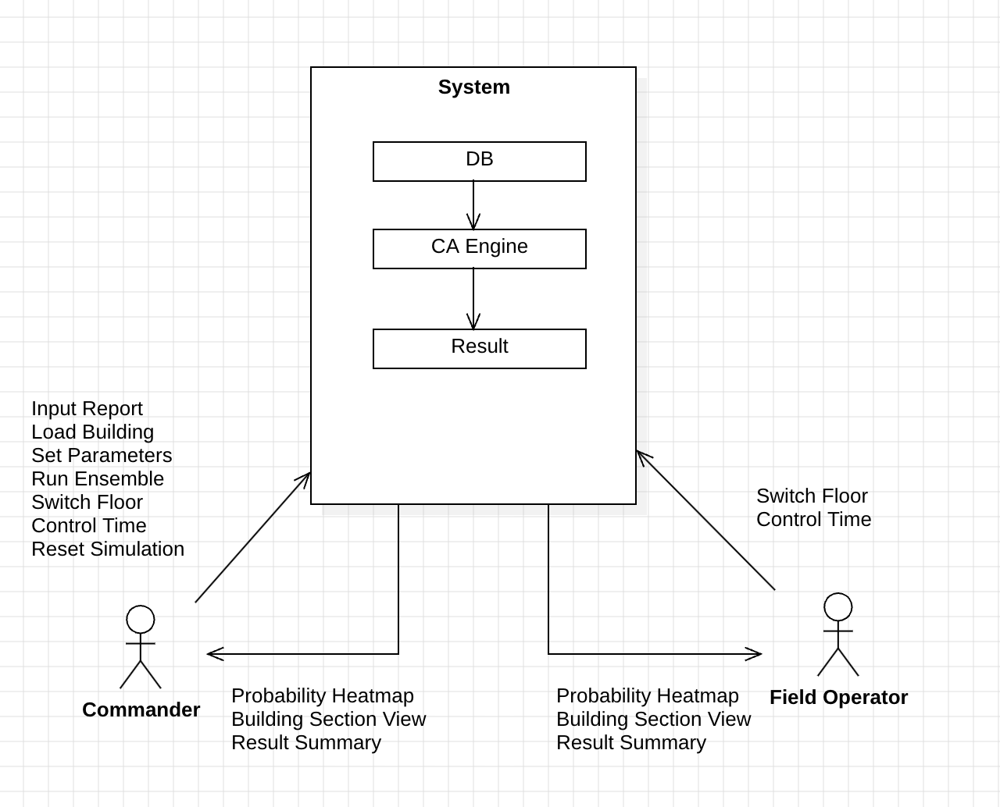

# FireWatch

### 소방 작전 의사결정 지원을 위한 셀룰러 오토마타 기반 건물 화재 확산 시뮬레이션 시스템

**Conceptualization Document**

* **학번:** 22012106
* **이름:** 이승민
* **E-mail:** dinola@naver.com
* **깃허브 주소** : https://github.com/dinnow123/FireWatch

## Revision History

| Revision date | Version # | Description | Author |
| --- | --- | --- | --- |
| 2026.03.27 | 0.1 | First Documentation | 이승민 |

## Contents

1. Business purpose
2. System context diagram
3. Use case list
4. Concept of operation
5. Problem statement
6. Glossary
7. References

   
---

## 1. Business purpose

### 1.1. Project background

　현행 재난·사고 대응 체계는 사건이 발생한 이후를 상정하며, 소방과 구조 활동에 있어 불완전한 정보를 바탕으로 신속한 의사결정이 요구된다. 이는 현장 대원들에게 심리적으로 큰 부담을 부여한다. 현재 미국의 FlowMSP, APX Fire RMS 등 기존 소방 지원 시스템은 건물 도면과 소화전 위치 등 사전에 등록된 정보를 조회하는 기능을 제공하지만, 화재가 시간에 따라 어떻게 확산될지를 동적으로 예측하는 기능은 갖추고 있지 않다. NIST가 개발한 FDS(Fire Dynamics Simulator)는 나비에-스토크스 방정식 기반의 정밀한 시뮬레이션을 제공하지만, 단일 시나리오의 계산에 수 시간에서 수일이 소요되어 실시간 작전 지원에는 적합하지 않다.

　이처럼 현장에서 활용 가능한 실시간 화재 확산 예측 시스템이 부재한 상황은, 과거의 대형 참사에서 이미 그 대가를 치른 바 있다. 2003년 2월 18일, 대구 지하철 중앙로역에서 발생한 화재 참사는 192명의 목숨을 앗아갔다. 당시 화재가 발생한 1079호 열차의 반대편 승강장에 1080호 열차가 상황을 알지 못한 채 진입하였고, 이로 인해 피해가 급격히 확대되었다. 만약 화재 발생 직후 연기와 화염의 확산 경로를 예측할 수 있었다면, 1080호의 진입을 막고 보다 신속한 대피를 유도할 수 있었을 것이다.

　한편 우리나라에서는 BIM의 공공건축물 설계 의무화가 단계적으로 시행되고 있으며, IoT 기반 화재경보 시스템은 발화 위치의 좌표와 실시간 온도 데이터를 제공할 수 있는 수준에 이르고 있다. 이러한 기술적 환경의 변화는 건물의 디지털 정보와 화재 감지 데이터를 결합하여 화재 확산을 동적으로 예측하는 시스템의 가능성을 열어준다.

　이러한 배경에서 본 프로젝트는, 화재 신고가 접수된 시점부터 초동 소방대가 현장에 도착하기까지의 짧은 시간을 활용하여, 건물 구조와 재질 정보를 기반으로 화재 확산을 시뮬레이션하고 그 결과를 관제관과 현장 요원에게 제공하는 시스템 'FireWatch'를 개발하고자 한다.

　본 시스템의 핵심 방법론으로 셀룰러 오토마타(Cellular Automata, 이하 CA)를 채택하였다. CA란 격자 형태로 배열된 셀(Cell)들이 이웃 셀의 상태에 따라 자신의 상태를 규칙적으로 업데이트하는 이산 수학 모델이다. 1940년대 폰 노이만(John von Neumann)이 제안하였으며, 콘웨이의 생명 게임(Conway's Game of Life)으로 널리 알려져 있다. 단순한 규칙의 반복만으로도 복잡한 거시적 패턴이 창발(emergent)하는 특성을 가지며, 이러한 특성 덕분에 산불 확산, 전염병 전파, 암 종양 성장 등 공간적 확산 현상의 모델링에 폭넓게 사용되어 왔다. 건물 내부 화재 확산에도 그 적용 가능성이 학술적으로 검증되어 있다.

　또한 단일 시뮬레이션의 결정론적 한계를 극복하기 위해, 현대 수치기상예보(numerical weather prediction, NWP)에서 확립된 앙상블 시뮬레이션 방법론을 도입한다. 확률적 CA를 복수 실행하고, 결과의 통계적 분포로부터 각 구역의 화재 도달 확률을 산출한다. 이 방법론은 산불 시뮬레이터 PROPAGATOR 등에서 이미 실증된 바 있다.

　물론 복잡계인 현실 세계를 완전히 예측하는 것은 원리적으로 불가능하다. 하지만 예측의 가치는 정확성에만 있지 않다. 가능한 시나리오의 범위를 좁히고, 의사결정자에게 구조화된 판단 근거를 제공하는 것만으로도 현장에서의 한 걸음은 더 빨라지고 더 많은 생명을 구할 수 있을 것이다. 대구의 아픔이 다시는 되풀이되지 않도록, 기술이 할 수 있는 일을 찾는 것이 본 프로젝트의 출발점이다.

#### 1.1.1. 기존 시스템의 한계와 FireWatch의 차별점

| 구분 | FlowMSP / APX | FDS | CAEva | PROPAGATOR | FireWatch |
| --- | --- | --- | --- | --- | --- |
| **목적** | 사전 계획 조회 | 정밀 화재 시뮬레이션 | 건물 화재 대피 시뮬레이션 | 산불 확산 예측 | 건물 화재 확산 예측 |
| **방법론** | 정적 도면 조회 | CFD | 셀룰러 오토마타 | 확률적 CA + 앙상블 | 확률적 CA + 앙상블 |
| **앙상블 시뮬레이션** | 미지원 | 미지원 | 미지원 | 지원 | 지원 |
| **확률 히트맵** | 미지원 | 미지원 | 미지원 | 지원 | 지원 |
| **What-if 시나리오** | 미지원 | 제한적 | 미지원 | 제한적 | 지원 |
| **계산 속도** | 즉시 (조회) | 수 시간~수일 | 수 초 | 수 초~수 분 | 수 초 |
| **실시간 작전 지원** | 불가 (정적) | 불가 (느림) | 가능 | 가능 (산불 한정) | 가능 |

* FlowMSP / APX — 사전에 등록된 건물 도면을 조회하는 정적 시스템으로, 화재의 동적 확산을 예측하지 못한다.
* FDS — 정밀한 CFD 시뮬레이션을 제공하나, 계산에 수 시간이 소요되어 현장 의사결정에는 활용이 어렵다.
* CAEva — CA 기반으로 건물 내부 화재를 시뮬레이션하나, 단일 실행 방식으로 앙상블 시뮬레이션을 지원하지 않아 결과의 확률적 신뢰도를 확보할 수 없다.
* ROPAGATOR — 확률적 CA와 앙상블 시뮬레이션을 결합하여 확률 히트맵을 제공하나, 산불에 특화되어 건물 내부 화재에는 적용할 수 없다.
  
 본 시스템 FireWatch는 PROPAGATOR에서 실증된 앙상블 셀룰러 오토마타 방법론을 건물 내부 화재에 적용하고, 스프링클러·방화셔터 등 소방 설비의 What-if 시나리오 비교 기능을 추가하여 소방 작전 의사결정 지원에 특화된 시스템으로 설계한다.

---

### 1.2. Target Market

본 시스템의 대상 시장은 다음과 같이 구분된다.

* **1차 대상 (핵심):** 소방 관제 기관 및 일선 소방서. 화재 신고 접수 후 현장 도착까지의 시간 동안 화재 확산을 예측하여 작전 의사결정을 지원하는 것이 본 시스템의 핵심 목적이다.
* **2차 대상 (확장):** 고층 건물, 지하시설(지하철역, 지하상가), 대형 복합시설 등 복잡한 구조를 가진 건축물의 방재 관리 기관. 사전 시나리오 탐색을 통한 방재 계획 수립 및 훈련 용도로 활용할 수 있다.
* **3차 대상 (장기 비전):** 군·경찰 등 재난 및 안보 대응 기관, GIS를 운용하는 관공서 및 기업. 본 시스템의 CA 기반 확산 엔진은 화재에 국한되지 않으며, 유독가스 누출, 화학물질 확산 등 건물 및 도시 환경에서의 다양한 위험 확산 시뮬레이션으로 확장 가능하다.

---

### 1.3. Goals

　건물 구조 및 재질 정보를 기반으로 확률적 셀룰러 오토마타 앙상블 시뮬레이션을 수행하고, 그 결과를 확률 히트맵으로 시각화하여 소방 관제관과 현장 요원들의 작전 판단을 지원하는 시뮬레이터를 개발한다.

　본 시스템은 관제관이 층별 화재 도달 확률을 확인하고, 소방 설비 조건을 변경하여 시나리오를 비교할 수 있는 단일 인터페이스 응용프로그램으로 구성된다.

---

## 2. System context diagram

**Commander → System:**
* Input Report : 화재 신고 정보 입력 (건물, 발화 위치, 층, 시각)
* Load Building : 건물 평면도 및 구조·재질 데이터 로드
* Set Parameters : 시뮬레이션 조건 설정 (스프링클러, 방화셔터, 문 개폐 상태)
* Run Ensemble : 앙상블 시뮬레이션 실행 (확률적 CA 복수 실행)
* Switch Floor : 층별 전환하여 모니터링
* Control Time : 시뮬레이션 시점 조절
* Reset Simulation : 시뮬레이션 초기화 및 재시작

**System → Commander:**
* Probability Heatmap : 층별 화재 도달 확률 히트맵
* Building Section View : 건물 단면도를 통한 층별 위험도
* Result Summary : 시뮬레이션 결과 요약 (화재 면적, 확산 방향, 도달 확률)

**Field Operator → System:**
* Switch Floor : 층별 전환하여 확인
* Control Time : 시뮬레이션 시점 조절 요청

**System → Field Operator:**
* Probability Heatmap : 층별 화재 도달 확률 히트맵
* Building Section View : 건물 단면도를 통한 층별 위험도
* Result Summary : 시뮬레이션 결과 요약

**System 내부 구조:**
* DB : 건물 평면도, 셀별 재질 정보, 소방 설비 위치 데이터 저장
* CA Engine : 확률적 셀룰러 오토마타 기반 화재 확산 앙상블 시뮬레이션 엔진
* Result : 앙상블 시뮬레이션 결과 (셀별 화재 도달 확률 분포)

---

## 3. Use case list

### 3.1. 화재 신고 입력

| Actor | Commander |
| --- | --- |
| **Description** | 관제관이 화재 신고 정보(건물, 발화 위치, 층, 시각)를 시스템에 입력한다. |

### 3.2. 건물 정보 로드

| Actor | Commander |
| --- | --- |
| **Description** | 관제관이 건물을 선택하면 해당 건물의 평면도, 셀별 재질 정보, 소방 설비(스프링클러, 방화셔터) 위치를 로드 받는다. |

### 3.3. 시뮬레이션 조건 설정

| Actor | Commander |
| --- | --- |
| **Description** | 스프링클러 작동 여부, 방화셔터 작동 여부, 문 개폐 상태 등 시뮬레이션 조건을 설정한다. 이를 통해 다양한 시나리오를 설정한다. |

### 3.4. 앙상블 시뮬레이션 실행

| Actor | Commander |
| --- | --- |
| **Description** | 관제관이 시뮬레이션을 시작한다. 시스템은 확률적 셀룰러 오토마타를 복수 실행(20회~50회)하여 화재 도달 확률 분포를 계산한다. |

### 3.5. 확률 히트맵 표시

| Actor | Commander |
| --- | --- |
| **Description** | 앙상블 시뮬레이션 결과를 층별 2D 확률 히트맵으로 시각화한다. 각 셀은 해당 셀이 화재에 도달할 확률을 나타낸다. |

### 3.6. 층별 전환

| Actor | Commander, Field Operator |
| --- | --- |
| **Description** | 1F, 2F, 3F, B1 등 층별 탭을 전환하여 각 층의 화재 확률 분포를 확인한다. 현장 요원 역시 자신의 디바이스로 이를 확인할 수 있다. |

### 3.7. 시뮬레이션 시간 조작

| Actor | Commander, Field Operator |
| --- | --- |
| **Description** | 시뮬레이션의 시점을 조절하여 특정 시간대(예: 도착 예상 시각)의 화재 확률 상태를 확인한다. 현장 요원 역시 시스템에 이를 요청할 수 있다. |

### 3.8. 건물 단면도 확인

| Actor | Commander, Field Operator |
| --- | --- |
| **Description** | 건물 전체의 층별 위험도를 단면도 형태로 한눈에 확인한다. 각 층이 색상으로 표시된 직사각형 스택으로 표현된다. |

### 3.9. 시뮬레이션 결과 요약 확인

| Actor | Commander, Field Operator |
| --- | --- |
| **Description** | 화재 확산 방향, 주요 위험 구역, 구역별 도달 확률, 예상 화재 면적 등의 정량적 요약 정보를 확인한다. 결과를 저장하여 사후 분석에 활용할 수 있다. |

### 3.10. 시나리오 비교

| Actor | Commander |
| --- | --- |
| **Description** | 관제관이 소방 설비 조건을 변경하여 앙상블 시뮬레이션을 재실행하고, 결과를 비교한다. (예: 스프링클러 정상 vs 고장 시 확산 면적 변화) |

### 3.11. 시뮬레이션 초기화

| Actor | Commander |
| --- | --- |
| **Description** | 현재 시뮬레이션을 초기화하고 새로운 신고 또는 새로운 조건으로 재시작할 수 있게 한다. |

---

## 4. Concept of operation

### 4.1. 화재 신고 입력

| Purpose | 관제관이 신고 내용 바탕으로 화재 발생 건물과 발화 위치를 시스템에 입력. |
| --- | --- |
| **Approach** | 관제관이 건물 목록에서 해당 건물을 선택하고, 평면도 위에서 발화 지점을 마우스 클릭으로 지정한다. 발화 층과 시각 정보도 함께 입력한다. |
| **Dynamics** | 화재 신고가 접수되어 시뮬레이션을 시작해야 하는 경우. |
| **Goals** | 신고 정보를 시스템에 입력하여 시뮬레이션 준비를 완료한다. |

### 4.2. 건물 정보 로드

| Purpose | 신고된 건물의 구조 및 재질 데이터를 로드. |
| --- | --- |
| **Approach** | 관제관이 건물을 선택하면 시스템이 건물 DB에서 층별 평면도를 2D 정사각형 격자로 로드한다. 각 셀에는 재질 정보(가연성, 열 전달 임계치, 확산 확률)와 소방 설비(스프링클러, 방화셔터) 유무가 포함된다. 층간 연결 정보(계단, 엘리베이터 셀)도 함께 로드된다. |
| **Dynamics** | 관제관이 건물을 선택한 경우. |
| **Goals** | 시뮬레이션에 필요한 건물 구조 데이터를 로드한다. |

### 4.3. 시뮬레이션 조건 설정

| Purpose | 시뮬레이션 실행 전 소방 설비 조건을 설정. |
| --- | --- |
| **Approach** | 관제관이 스프링클러 작동 여부, 방화셔터 작동 여부, 특정 문의 개폐 상태를 설정한다. 이를 통해 '스프링클러 정상 + 셔터 정상', '스프링클러 고장 + 셔터 정상', '둘 다 고장' 등 다양한 What-if 시나리오를 구성한다. |
| **Dynamics** | 건물 정보 로드가 완료되고 시뮬레이션을 시작하기 전. |
| **Goals** | 시뮬레이션 조건을 설정하여 시나리오를 구성한다. |

### 4.4. 앙상블 시뮬레이션 실행

| Purpose | 확률적 CA 앙상블 시뮬레이션을 실행. |
| --- | --- |
| **Approach** | 관제관이 시작 버튼을 누르면 확률적 셀룰러 오토마타가 복수 실행(20회~50회)된다. 각 실행에서 매 틱(tick, 1턴)마다 화재 셀이 인접 8방향(상하좌우 및 대각, Moore 이웃)으로 열을 전달하며, 재질별 확산 확률에 따라 발화가 결정된다. 이때 대각선 방향은 상하좌우의 이웃셀과의 거리보다 멀기 때문에 거리 보정을 위해 가중치를 낮게 적용한다. 시뮬레이션이 시작되면 시나리오 조건을 반영한다. 스프링클러는 발동 시 해당 셀의 열을 감소시키고, 방화셔터는 벽으로 전환되어 확산을 물리적으로 차단한다. 복수 실행 결과를 종합하여 각 셀별 화재 도달 확률을 산출한다. |
| **Dynamics** | 신고 정보가 입력되고 시나리오 조건 설정이 완료된 경우. |
| **Goals** | 앙상블 시뮬레이션으로 화재 도달 확률 분포를 산출한다. |

### 4.5. 확률 히트맵 시각화

| Purpose | 앙상블 시뮬레이션 결과를 확률 히트맵으로 시각화. |
| --- | --- |
| **Approach** | 각 셀이 '화재에 도달할 확률'에 따라 색상으로 표시된다. 0%(흰색), 20%(연노랑), 50%(주황), 80%(빨강), 100%(진한 빨강)의 그라데이션으로, 확률에 따른 위험도와 안전도를 쉽게 파악할 수 있다. 벽은 회색으로 표시한다. |
| **Dynamics** | 앙상블 시뮬레이션이 완료된 경우. |
| **Goals** | 화재 도달 확률을 셀에 색이 입혀진 히트맵으로 시각화한다. |

### 4.6. 층별 전환

| Purpose | 다층 건물 및 지하공간의 각 층별 확률 분포를 확인. |
| --- | --- |
| **Approach** | 관제관 또는 현장요원이 층별 탭(1F, 2F, 3F, B1 등)을 클릭하면 해당 층의 확률 히트맵으로 전환된다. 각 층은 독립적인 2D 그리드로 관리되며, 계단/엘리베이터 셀을 통해 층간 화재 확산(굴뚝 효과)이 표현된다. |
| **Dynamics** | 시뮬레이션이 완료되었으며 여러 층을 확인하고 싶은 경우. |
| **Goals** | 층별 전환을 통해 건물 전체의 화재 확률 분포를 모니터링한다. |

### 4.7. 시뮬레이션 시간 조작

| Purpose | 시뮬레이션의 시간축을 제어. |
| --- | --- |
| **Approach** | 관제관 또는 현장요원이 시뮬레이션 시점을 조절하여 특정 시간대의 확률 분포를 확인할 수 있다. |
| **Dynamics** | 시뮬레이션이 완료되었으며 특정 시점의 상태를 확인하고 싶은 경우. |
| **Goals** | 시간 조작을 통해 원하는 시점의 화재 확률 상태를 확인한다. |

### 4.8. 건물 단면도 확인

| Purpose | 건물 전체의 층별 위험도를 한눈에 파악. |
| --- | --- |
| **Approach** | 건물 단면을 나타내는 패널에서 각 층의 평균 화재 확률이 색상으로 요약 표시된다. 빨간 층은 높은 화재 확률, 노란 층은 부분적 위험, 흰 층은 안전을 나타내어 건물 전체 상황을 즉시 파악할 수 있다. |
| **Dynamics** | 시뮬레이션이 완료되었으며 건물 전체 상황을 확인하고 싶은 경우. |
| **Goals** | 건물 단면도를 통해 층별 위험도를 한눈에 파악한다. |

### 4.9. 시뮬레이션 결과 요약 확인

| Purpose | 현장요원에게 전달할 정량적 요약 정보를 확인. |
| --- | --- |
| **Approach** | 관제관 및 현장요원 뷰에 다음의 정보가 표시된다: 예상 화재 면적(전체 바닥 면적 대비 비율), 화재 확산 주요 방향, 주요 구역별 도달 확률, 스프링클러/방화셔터 작동 상태. 관제관은 이 정보를 기반으로 현장 요원에게 작전 지시를 내린다. 필요 시 결과를 저장하여 사후 분석에 활용할 수 있다. |
| **Dynamics** | 시뮬레이션 결과가 나온 경우. |
| **Goals** | 현장요원에게 전달할 핵심 정보를 정량적으로 요약하여 제공한다. |

### 4.10. 시나리오 비교

| Purpose | 소방 설비 조건 변경에 따른 시뮬레이션 결과를 비교. |
| --- | --- |
| **Approach** | 관제관이 필요에 따라 소방 설비 조건(스프링클러 정상/고장, 방화셔터 정상/고장 등)을 변경하여 앙상블 시뮬레이션을 재실행하고, 결과의 차이를 비교한다. 예를 들어 '스프링클러 가동 시 화재 면적 62% 감소' 등의 정량적 비교를 제공하여, 설비 상태가 화재 확산에 미치는 영향을 파악하고 대응 인력 규모를 판단할 수 있다. |
| **Dynamics** | 시뮬레이션 결과를 확인한 후 다른 조건으로 비교하고 싶은 경우. |
| **Goals** | 다양한 시나리오 탐색을 통해 최적의 대응 전략 수립을 지원한다. |

### 4.11. 시뮬레이션 초기화

| Purpose | 시뮬레이션을 초기 상태로 되돌림. |
| --- | --- |
| **Approach** | 관제관이 초기화 버튼을 누르면 모든 셀이 초기 상태로 돌아가고, 새로운 신고 정보 또는 새로운 조건으로 시뮬레이션을 재시작할 수 있다. |
| **Dynamics** | 시뮬레이션을 새로운 조건으로 재시작하고 싶은 경우. |
| **Goals** | 시뮬레이션을 초기화하여 새로운 시나리오를 실행할 수 있게 한다. |

---

## 5. Problem statement

### 5.1. Overview

　FireWatch는 건물 구조 및 재질 정보를 기반으로 확률적 셀룰러 오토마타의 앙상블 시뮬레이션을 수행하여, 소방 관제관과 현장 요원들의 작전 판단을 지원하는 시스템이다. 화재 신고 접수에서 현장 도착까지의 짧은 시간 내에 확률적 화재 확산 예측을 제공하는 것을 목표로 한다.

　본 시스템의 개발에서 직면하는 기술적 문제와 설계 판단은 다음과 같다.

### 5.2. Problem definition

#### 5.2.1. Problem #1 — CA 모델의 셀 설정에 따른 트레이드-오프(Trade-Off)

　CA 모델의 종류는 매우 다양하다. 본 프로젝트의 설계에 있어서도 여러 선택지가 존재하며, 각 선택에는 정밀도, 계산 비용, 도메인 적합성 간의 트레이드-오프가 존재한다.

　대표적으로 격자 형태의 선택 문제를 생각해야 한다. 화재 확산 예측 모델은 주로 육각형 격자를 채택한다. 이는 6방향 이웃이 모두 등거리이므로 등방성으로 확산되는 화재의 특성에 적합하기 때문이다. 그러나 건물은 일반적으로 직교 구조를 지닌다. 직각 벽과 직선 복도, 직사각형의 공간을 육각형 모델로 표현하는 것은 부적합할 수 있다. 한편 사각형 모델은 계산 비용은 작지만 정밀도에서 문제를 발생시킨다.

　건물 구조와 화재 확산에 서로 다른 격자 체계(건물은 사각형, 화재는 육각형 등)를 적용하는 이중 레이어 접근도 생각해볼 수 있으나, 구현 복잡성 대비 건물 내부 환경에서의 정밀도 개선이 한계가 있을 것이라 예상된다.

　따라서 본 시스템은 정사각형 격자를 채택하되, 이웃을 4방향(상하좌우)이 아닌 8방향(상하좌우 및 대각선)으로 설계하고, 대각선 방향의 거리 차이를 보정하기 위해 열 전달 가중치를 적용하고자 한다.

#### 5.2.2. Problem #2 — 결정론적 모델과 확률적 모델 사이의 딜레마

　단순 결정론적 모델은 동일 조건에서 동일한 결과를 도출한다. 이는 현실에서의 다양한 변수와 불확실성을 반영하지 못한다는 치명적인 한계를 지닌다. 반면, 확률적 모델은 실행마다 다른 결과를 도출한다. 이렇게 도출된 개별 결과는 재현성이 없어 신뢰하기 어렵다.

　본 시스템은 이러한 딜레마를 현대 수치기상예보(Numerical Weather Prediction)의 앙상블 시뮬레이션 방법론에서 착안하여 해결하고자 한다. 화재 확산에 대한 기본적인 규칙 기반 로직을 설계하되, 불확실성을 반영하기 위해 확률적 요소를 도입한다. 그리고 이 확률적 모델을 복수 실행(20회~50회)하여 결과의 통계적 분포를 산출한다. 이를 통해 개별 실행의 결과가 아닌 셀별 화재 도달 확률을 제시함으로써, 결정론적 모델의 '거짓된 확신(False confidence)'과 단일 확률적 모델의 재현 불가능성을 동시에 극복한다.

#### 5.2.3. Problem #3 — 3차원 현상의 2차원 모델링

　화재는 본질적으로 3차원 현상이지만, 층별로 바닥과 천장에 의해 격리된 건물의 구조적 특성을 고려하면 반드시 3차원 모델로 설계할 필요는 없다. 3차원 모델은 필요 이상의 정밀도를 위해 계산 비용을 높이고, 현장에서의 실시간 활용 가능성을 떨어뜨린다.

　따라서 본 시스템은 각 층을 독립적인 2차원 격자로 모델링하고, 층간 확산은 계단이나 엘리베이터 등의 연결 셀을 통해서만 이루어지도록 설계한다. 이때 열의 상승 특성을 고려하여 상향 열 전달에는 높은 가중치를, 하향 열 전달에는 낮은 가중치를 적용한다.

　다만, 외벽과 창문을 통한 층간 화재 확산은 본 모델의 2차원 구조로는 표현이 제한적이며, 향후 외벽 셀 간 층간 연결 규칙을 추가하는 방식으로 확장을 검토할 수 있다.

#### 5.2.4. Problem #4 — 앙상블 시뮬레이션의 실행 방식

　앙상블 시뮬레이션은 확률적 모델을 복수 실행하여 통계적 분포를 산출하는 방식이다. 실행 횟수가 많을수록 결과의 신뢰도는 높아지지만, 그만큼 계산 시간이 증가한다. 본 시스템의 핵심 목표가 신고 접수에서 현장 도착까지의 짧은 시간 내에 결과를 제공하는 것인 만큼, 실행 방식의 선택은 시스템의 실용성을 좌우하는 중요한 문제이다.

　실행 방식에는 순차 실행과 병렬 실행이 있다. 병렬 실행은 복수의 시뮬레이션을 동시에 처리하여 속도를 크게 높일 수 있으나, 구현 복잡도가 증가하고 실행 환경에 대한 하드웨어 의존성이 생긴다. 본 시스템은 경량 CA 모델을 채택하였으므로 단일 시뮬레이션의 계산량이 충분히 작다. 따라서 순차 실행 방식으로도 20회~50회의 앙상블 시뮬레이션을 수 초 내에 완료할 수 있어 실시간 작전 지원 요구사항을 충족한다.

　다만, 향후 격자 해상도의 증가, 실행 횟수의 확대, 또는 대규모 건물 시뮬레이션이 요구될 경우 병렬 실행으로의 전환을 검토할 수 있다.

#### 5.2.5. Problem #5 — 복잡계로서의 화재 현상과 예측의 물리적 한계

　화재는 전형적인 복잡계 현상이며, 기온, 습도, 풍속, 가구 배치, 환기 상태 등 무한한 변수가 작용한다. 본 시스템은 건물 구조와 재질을 주요 변수로 사용하며, 기상 조건 등 외부 변수는 향후 확장 요소로 남겨둔다.

　기상예보의 예보 구간(forecast horizon) 개념을 적용하여, 시뮬레이션 초기 시점의 예측은 신뢰도가 높고 시간이 경과할수록 불확실성이 증가함을 앙상블 결과의 분산으로 제시한다. 이를 통해 시스템의 사용자는 '이 시점까지의 예측은 신뢰할 수 있고, 이후는 가능성의 범위로 해석해야 한다'는 판단을 내릴 수 있다.

#### 5.2.6. Problem #6 — 미등록 건물 존재 가능성

　본 시스템은 사전 등록된 건물 데이터에 의존한다. 이는 당장에는 문제로 작용할 수 있으나 BIM 의무화가 시행되고 있으며 이와 연동하여 점진적으로 해소될 것으로 기대된다.

### 5.3. NFRs (비기능적 요구사항)

* 앙상블 시뮬레이션 20회가 20초 이내에 완료되어야 한다.
* Python 표준 라이브러리 기반으로 구현한다.
* 계산 안정화를 위해 건물 1개 층의 그리드 크기는 100×100 셀 내외로 한다.
* 긴박한 현장 상황에서도 직관적으로 사용할 수 있도록 인터페이스의 편의성을 확보해야 한다.

---

## 6. Glossary

| 용어 | 설명 |
| --- | --- |
| **셀룰러 오토마타 (Cellular Automata)** | 격자 형태의 셀이 이웃 셀의 상태에 따라 규칙 기반으로 자신의 상태를 업데이트하는 이산 수학 모델. 1940년대 폰 노이만이 제안. |
| **Moore 이웃 (Moore Neighborhood)** | 중심 셀을 둘러싼 8개 셀(상하좌우 + 대각선 4방향)을 이웃으로 정의하는 방식. |
| **확률적 셀룰러 오토마타 (Stochastic CA)** | 상태 전이 규칙에 확률적 요소를 포함하여 동일 조건에서도 실행마다 다른 결과를 생성하는 CA 변종. |
| **앙상블 시뮬레이션 (Ensemble Simulation)** | 확률적 모델을 복수 실행하고, 결과의 통계적 분포로부터 확률적 예측을 도출하는 방법론. 수치기상예보에서 확립. |
| **확률 히트맵 (Probability Heatmap)** | 앙상블 시뮬레이션 결과에서 각 셀의 화재 도달 확률을 색상으로 시각화한 맵. |
| **tick** | 시뮬레이션의 이산 시간 단위. 매 tick마다 모든 셀의 상태가 동시에 업데이트되며, 화재 확산이 한 단계 진행된다. |
| **FDS (Fire Dynamics Simulator)** | NIST가 개발한 CFD 기반 화재 시뮬레이터. 나비에-스토크스 방정식의 수치해석으로 정밀한 결과를 제공하나 연산 시간이 길다. |
| **BIM (Building Information Modeling)** | 건축물의 설계, 시공, 유지관리에 필요한 정보를 3차원 모델에 통합 관리하는 기술. |
| **스프링클러 (Sprinkler)** | 화재 감지 시 자동으로 물을 분사하여 화재를 억제하는 소방 설비. 시뮬레이션에서 해당 셀의 열을 감소시킨다. |
| **방화셔터 (Fire Shutter)** | 화재 감지 시 자동으로 하강하여 구역을 물리적으로 차단하는 소방 설비. 시뮬레이션에서 해당 셀을 벽으로 전환한다. |
| **What-if 시나리오** | 소방 설비 조건 등을 변경하여 '만약 ~라면?' 형태의 가정을 탐색하는 시뮬레이션 방식. |
| **창발 (Emergence)** | 개별 구성 요소의 단순한 규칙과 상호작용으로부터 전체 시스템 차원에서 예측하지 못한 복잡한 패턴이나 행동이 나타나는 현상. 셀룰러 오토마타의 핵심 특성 중 하나이다. |
| **수치기상예보 (Numerical Weather Prediction, NWP)** | 대기의 물리 법칙을 수학적으로 모델링하여 컴퓨터로 기상을 예측하는 방법론. 앙상블 시뮬레이션 기법이 이 분야에서 확립되었다. |
| **나비에-스토크스 방정식 (Navier-Stokes Equations)** | 유체의 운동을 기술하는 편미분 방정식. 질량 보존, 에너지 보존, 운동량 보존 법칙을 기반으로 하며, FDS 등 CFD 기반 화재 시뮬레이터의 핵심 수학적 기반이다. |
| **예보 구간 (Forecast Horizon)** | 예측 시점으로부터의 경과 시간에 따라 예측 신뢰도가 감소하는 특성을 나타내는 개념. 기상예보에서 유래. |
| **거짓된 확신 (False Confidence)** | 결정론적 모델이 단일 결과만을 제시함으로써 사용자에게 실제보다 높은 확신을 부여하는 현상. |

---

## 7. References

1. NIST, "Fire Dynamics Simulator (FDS)" — https://pages.nist.gov/fds-smv/
2. FlowMSP — https://flowmsp.com/
3. APX Data — https://apxdata.com/
4. Trucchia, A. et al., "PROPAGATOR: An Operational Cellular-Automata Based Wildfire Simulator", Fire, 3(3), 2020 — https://www.mdpi.com/2571-6255/3/3/26
5. Czerniak, J. et al., "A Cellular Automata-Based Simulation Tool for Real Fire Accident Prevention (CAEva)", Mathematical Problems in Engineering, 2018 — https://www.hindawi.com/journals/mpe/2018/3058241/
6. Wikipedia, Cellular Automaton — https://en.wikipedia.org/wiki/Cellular_automaton
7. 기상청, 앙상블 예측 기법 — https://www.kma.go.kr/down/e-learning/hands/hands_17.pdf
8. Wikipedia, Ensemble Forecasting — https://en.wikipedia.org/wiki/Ensemble_forecasting
9. Wikipedia, 결정론적 알고리즘 — https://ko.wikipedia.org/wiki/결정론적_알고리즘
10. Wikipedia, — 복잡계 https://ko.wikipedia.org/wiki/복잡계
11. 국가기록원, *대구 지하철 화재사고* — https://www.archives.go.kr/next/search/listSubjectDescription.do?id=001920
