# FireWatch

### 소방 작전 의사결정 지원을 위한 셀룰러 오토마타 기반 건물 화재 확산 시뮬레이션 시스템

**Design Document**

* **학번:** 22012106
* **이름:** 이승민
* **E-mail:** dinola@naver.com
* **GitHub:** https://github.com/dinnow123/FireWatch

## Revision History

| Revision date | Version # | Description | Author |
| --- | --- | --- | --- |
| 2026.05.28 | 0.1 | Design | 이승민 |

1. Introduction
본 문서는 Conceptualization, Analysis에 이은 Design 단계의 산출물로, FireWatch 시스템에 대한 세 번째 문서이다. Analysis 단계에서 도출한 Use Case와 Domain 분석을 바탕으로, 이 단계에서는 시스템의 정적 구조(Class Diagram), 동적 상호작용(Sequence Diagram), 상태 전이(State Machine Diagram)를 정의하고 설명하는 것을 주로 다룬다. 즉 "무엇을 만들 것인가"에서 "어떻게 만들 것인가"로 초점을 옮기는 단계이다.
1.1. 시스템 개요 및 배경
화재는 발생 직후 매우 빠르게 확산되며, 초기 대응 단계에서의 의사결정이 인명 및 재산 피해 규모를 결정짓는 핵심 요소로 작용한다. 그러나 현재 화재 관제 환경에서는 신고자의 제한적 진술과 정적인 평면도에 주로 의존하며, 화재의 확산 방향이나 속도에 대한 정량적 예측 정보는 제공되지 않는다. 기존의 대표적 화재 시뮬레이션 도구인 NIST의 FDS(Fire Dynamics Simulator)는 Navier-Stokes 방정식 기반의 CFD 모델로 화재 동역학을 정밀하게 재현하지만, 단일 워크스테이션 기준 수 시간에서 수 일의 연산 시간을 요구하여 신고 접수 직후의 실시간 의사결정 지원에는 현실적 제약이 있다.
FireWatch는 이러한 한계를 보완하기 위해 확률적 셀룰러 오토마타 기반의 앙상블 시뮬레이션을 활용한다. 동일한 조건에서 다수의 시뮬레이션을 수행하고 결과를 종합함으로써 각 구역별 화재 도달 확률을 산출하며, 단일 결과가 아닌 확률 분포 형태의 예측을 제공한다. 이를 통해 사용자(소방 관제관 및 현장요원)는 위험도가 높은 구역을 직관적으로 식별하고, 소방 설비 작동 여부 등에 따른 시나리오를 비교하여 대응 전략을 수립할 수 있다.
1.2. 설계 철학 — 인식론적 결정론과 확률적 샘플링
본 시스템은 현상 자체를 본질적으로 무작위적이라고 가정하지 않는다. 동일한 초기 조건과 미시 상태가 완전히 주어진다면 화재 확산 과정 역시 하나의 결과로 결정된다고 보는 인식론적 결정론(Epistemic Determinism)의 관점을 따른다.
이 입장은 임의의 선택이 아니라 화재 현상의 물리적 본성에서 도출된 것이다. 화재 확산은 열역학 제1·제2법칙, 푸리에 열전도 법칙, 연소 화학 반응식, 나비에-스토크스 방정식 등 결정론적 지배 방정식들의 상호작용으로 기술된다. 즉 원리적으로는 모든 미시 상태가 완전히 주어지면 단일한 확산 경로가 도출되어야 한다. 본 시스템이 확률을 도입하는 이유는 이 결정성을 부정하기 때문이 아니라, 그 미시 상태를 완전히 관측할 수 없기 때문이다.
그러나 실제 환경에서는 모든 변수를 완전하게 관측할 수 없으므로(구체 내용은 1.3절 참조), 이러한 정보 부족(epistemic uncertainty)을 표현하기 위해 확률적 샘플링(stochastic sampling)을 도입한다. 따라서 시스템은 서로 다른 random seed를 사용한 다수의 재현 가능한(reproducible) 시뮬레이션 실행을 수행하며, 이를 통해 가능한 확산 경향의 분포를 추정한다. 즉 본 시스템의 확률은 물리 현상의 본질적 무작위성을 의미하기보다, 관측 불가능한 변수에 대한 정보 부족을 정량화한 결과로 해석된다.
화재 동역학은 또한 카오스적(chaotic) 성질을 가진다. 초기 조건의 미세한 차이가 거시적 결과의 큰 차이로 증폭되는 민감성 때문에, 원리적으로는 결정론적인 시스템도 실용적으로는 단일 예측이 어렵다. 마치 기상 시스템이 결정론적 방정식을 따르면서도 장기 예측이 불가능한 것과 같다. 이 두 측면 — 원리적 결정성과 실용적 예측 불가능성 — 은 모순이 아니라 동전의 양면이며, 확률적 앙상블 접근은 이 간극을 메우는 표준적 방법이다.
이러한 입장은 과학 계산 분야에서 널리 쓰이는 불확실성 정량화(uncertainty quantification)의 관점과 일치한다. 기상 앙상블 예측, CFD 불확실성 전파, 몬테카를로 수송 계산 등은 모두 결정론적 지배 방정식 위에서 불확실성 전파를 위해 확률적 샘플링을 사용하는 구조를 가진다.
이 철학은 시스템 구조에 직접 반영된다. EnsembleRunner가 서로 다른 seed로 N회 시뮬레이션을 수행하여 확률 분포를 추정하고, EnsembleResult가 Wilson Score 신뢰구간을 함께 산출한다. 나아가 HeatmapView는 신뢰구간의 폭을 시각화하여, 통계적으로 안정적인 영역(발화점 인근, 안전 구역)과 진정으로 불확실한 경계 영역을 구분해 보여준다.
이러한 구분은 소방 작전 의사결정의 실제 양상과 직접 연결된다. 단일 예측만 제공하는 시스템은 "어디가 위험한가"라는 질문에는 답하지만, "그 판단이 얼마나 확실한가"에는 답하지 못한다. 그러나 실제 작전 환경에서 관제관과 현장요원은 이 두 정보를 모두 필요로 한다. 확률이 동일하더라도 신뢰구간이 좁은 영역은 안정적 판단이 가능한 영역이고, 신뢰구간이 넓은 경계 영역은 추가 정보 수집(현장 보고, 센서 확인 등)이 필요한 영역이다. 본 시스템의 불확실성 시각화는 사용자가 이 두 종류의 정보를 동시에 인지하여, 자원 배분과 위험 의사결정의 우선순위를 합리적으로 설정할 수 있도록 지원한다.
1.3. 정보 부족의 구체화 — 관측 불가능한 변수들
1.2절에서 언급한 "관측 불가능한 변수에 대한 정보 부족"은 추상적인 표현이 아니라 화재 관제 환경의 실제적 제약이다. 신고 접수 직후 수십 초~수 분의 작전 시간 척도 안에서, 시스템이 알 수 있는 정보는 신고된 발화 위치·층·시각과 사전 등록된 건물의 평면도·재질·소방 설비 위치 정도에 한정된다. 정밀한 시뮬레이션에 필요한 다음 변수들은 사실상 모두 미지수다.
카테고리구체 예영향유체 역학적 변수실내 공기 흐름 패턴, 환기구 통과 기류, 화재 시점의 풍압, 화염 plume 형태화재 전파 방향과 속도 결정재료의 미시 상태목재의 함수율과 결 방향, 직물 섬유 밀도, 표면 산화 정도, 미세 균열발화 임계값과 연소 속도 편차구조물 배치가구의 정확한 위치·재질, 일시적 적재물(상자·종이 더미), 칸막이 상태가연물의 공간적 분포개폐 상태문·창문·환기구·방화문의 실시간 개폐 여부산소 공급과 화재 전파 경로이력 정보건물의 노후화 정도, 이전 화재·수해 이력, 청소·보수 시점재질의 실제 화학적 상태
이러한 변수들은 그 자체로 결정론적 물리량이지만, 실제 작전 시점에 그 값을 측정하거나 알아낼 수단이 없다. 발생한 화재 현장에 들어가 풍압을 측정하거나 목재 함수율을 분석할 수는 없다. 또한 이러한 변수들의 조합은 단순 합이 아니라 비선형적 상호작용(예: 환기 조건과 재료 함수율의 결합 효과)을 만들어내므로, 한두 가지를 추정으로 보완한다고 해도 전체 불확실성이 크게 줄어들지 않는다.
따라서 본 시스템은 이 미지수들을 개별적으로 추정하지 않는다. 대신 그 합쳐진 효과를 확률 분포의 형태로 일괄 표현한다. 서로 다른 seed로 수행되는 각 앙상블 실행은 이 미지수들의 가능한 한 조합을 표본으로 추출하는 것과 의미적으로 동일하며, N회의 반복은 그 표본 공간을 통계적으로 탐색하는 과정이다. 이러한 접근은 "어떤 변수를 모르는지"를 명시적으로 인정하면서도 실용적 예측을 가능하게 한다.
1.4. 접근법의 선택 — FDS와 FireWatch의 비교
1.3절에서 살펴본 정보 부족 상황은 시뮬레이션 도구 선택에도 직접적인 영향을 준다. 본 시스템이 NIST의 FDS와 같은 결정론적 CFD 모델을 직접 사용하지 않고 확률적 셀룰러 오토마타를 채택한 이유가 여기에 있다.
FDS는 나비에-스토크스 방정식을 직접 수치해석으로 풀어 단일한 결정론적 결과를 산출하는 도구로, 화재공학 연구·설계 검증·법적 분석 등 영역에서 표준적으로 활용된다. 그 정밀도는 매우 높지만, 두 가지 측면에서 본 시스템의 목표 환경과 어긋난다. 첫째, 단일 워크스테이션에서 수 시간~수 일의 연산 시간을 요구하므로, 신고 접수 직후 수십 초 내의 실시간 의사결정 지원이라는 작전 시간 척도와 맞지 않는다. 둘째, 그 정밀도가 의존하는 미시 상태 정보(공기 흐름장의 초기 조건, 재료의 정확한 물성, 가구 배치 등)는 1.3절에서 살펴본 대로 실제 작전 환경에서 확보할 수 없다. 즉 입력 정보가 불확실한 상황에서 정밀한 단일 결과를 산출하는 것은, 결과의 정밀도가 입력의 불확실성을 가려버리는 위험을 만든다.
따라서 본 시스템은 처음부터 다른 전제 위에 선다. 미시 상태에 대한 정보 부족을 출발점으로 인정하고, 그 부족을 확률 분포로 표현하는 접근을 택한다. 셀룰러 오토마타는 격자 기반의 단순한 규칙으로 화재 확산의 거시적 경향을 빠르게 추정할 수 있고, 앙상블 반복을 통해 정보 부족을 확률적으로 표본화할 수 있는 자연스러운 구조를 제공한다. 정리하면, FDS가 "완전한 정보 위에서 정밀한 단일 답"을 추구한다면, FireWatch는 "불완전한 정보 위에서 정직한 확률적 답"을 추구한다. 두 도구의 차이를 정리하면 아래 표와 같다.
측면FDS (결정론적 CFD)FireWatch (확률적 CA + 앙상블)정보 가정미시 상태 완전 관측 가능미시 상태 정보 부족 인정출력단일 결정론적 경로확률 분포 + 신뢰구간계산 비용수 시간 ~ 수 일수십 초사용 시점사후 분석 · 설계 검증 · 법적 분석실시간 작전 의사결정 지원정밀도의 의미입력 정확도에 의존불확실성을 함께 표현적합한 질문"정확히 어떻게 탔는가""어디가 위험하고 얼마나 확실한가"
두 도구는 경쟁 관계가 아니라 보완 관계다. 사후 분석과 건물 설계 검증에는 FDS가 적합하고, 실시간 작전 지원에는 FireWatch와 같은 확률적 접근이 적합하다. 본 시스템은 후자의 영역, 즉 "정밀도가 아니라 시의성과 정직성이 더 중요한 영역"을 의도적으로 선택한 결과물이다.
1.5. 아키텍처 개요
본 시스템은 시뮬레이션 엔진이 핵심을 이루는 시스템이므로, UI 프레임워크 중심의 MVC/MVVM 패턴 대신 고전적 계층형 아키텍처(Layered Architecture)를 채택한다. MVC/MVVM은 화면과 데이터의 양방향 동기화가 빈번한 대화형 애플리케이션에 적합한 반면, 본 시스템의 본질은 화면 갱신이 아니라 무거운 계산(앙상블 시뮬레이션) 그 자체에 있다. 사용자 입력은 한 번 수집되어 엔진으로 전달되고, 엔진의 출력은 단방향으로 화면에 흐른다. 이러한 단방향 데이터 흐름과 계산 중심 구조에는, 관심사를 수평 계층으로 분리하고 의존 방향을 한쪽으로 고정하는 계층형 아키텍처가 더 자연스럽게 부합한다. 이는 과학 계산 소프트웨어나 시뮬레이션 엔진에서 널리 쓰이는 구조이기도 하다. 시스템은 책임에 따라 세 계층으로 구성된다.

Domain Layer: 건물·층·셀·시나리오 등 핵심 개념을 표현한다.
Engine Layer: 확률적 셀룰러 오토마타 시뮬레이션을 수행한다.
UI / Adapter Layer: 사용자 입력 수집과 결과 시각화를 담당한다.

계층 간 의존은 단방향(UI → Engine → Domain)을 유지하여 결합도를 낮춘다. 이 구조는 시뮬레이션 로직(Engine)을 UI와 데이터로부터 독립시켜, 엔진을 단독으로 테스트하고 재사용할 수 있게 한다. 특히 본 시스템의 핵심 가치인 앙상블·신뢰구간 계산 로직이 특정 UI 기술(PyQt6)에 묶이지 않으므로, 향후 웹 인터페이스나 배치 분석 도구 등 다른 형태로의 확장이 용이하다.
1.6. 본 시스템의 한계
본 설계 문서는 시스템의 가치와 함께 그 한계를 명확히 인정한다. 학술적 정직성의 차원에서, 다음 한계들을 사전에 밝힌다.
첫째, 모델 파라미터의 경험적 성격이다. 재질별 발화 임계값, 층간 굴뚝 효과 가중치, 소방 설비의 효과 계수 등은 화재공학 문헌에 기반한 검증된 값이 아니라 경험적으로 설정된 단순화 값이다. 따라서 본 시스템이 산출하는 발화 확률의 절대값은 물리적 정확도를 보장하지 않는다.
둘째, 추상화 수준의 한계다. 본 시스템은 연기 확산, 산소 농도 변화, 외벽을 통한 화재 전파, 대피 인원의 흐름 등 실제 화재의 주요 요소들을 모델에 포함하지 않는다. 특히 실제 화재 사망의 주요 원인인 연기와 유독가스는 현재 모델 범위 밖이다.
셋째, 신뢰구간의 의미적 범위다. 본 시스템이 제공하는 신뢰구간은 앙상블 샘플링의 통계적 불확실성만을 측정하며, 모델 파라미터 자체의 불확실성은 포함하지 않는다.
이러한 한계로 인해, 본 시스템의 결과는 실제 작전 의사결정에서 절대적 기준이 아니라 참고 자료로 활용되어야 하며, 화재공학 전문가의 검토와 실측 데이터 기반 보정을 전제로 한다.
1.7. 시스템의 가치와 나아갈 방향
위 한계에도 불구하고, 본 시스템의 핵심 가치는 파라미터의 정밀도가 아니라 방법론에 있다. 확률적 셀룰러 오토마타, 앙상블 시뮬레이션, 신뢰구간 시각화를 결합하여 불확실성을 정량화하고 시각적으로 전달하는 접근법이 본 시스템의 기여다. 또한 모든 시나리오가 동일한 파라미터 위에서 일관되게 계산되므로, 결과의 절대값이 아닌 시나리오 간 상대 비교(예: 스프링클러 작동 여부에 따른 위험도 차이)는 의미 있는 의사결정 정보를 제공한다.
본 시스템은 다음과 같은 방향으로 발전할 수 있다.

파라미터 보정: Implementation 이후 단계에서 화재공학 표준값(예: SFPE Handbook) 또는 실측 데이터와의 비교를 통해 재질·설비 파라미터를 보정한다.
물리 단위 도입: 현재 추상 단위로 처리되는 heat을 온도 또는 에너지의 물리 단위로 정의하여 결과의 물리적 의미를 확보한다.
모델 확장: 연기 확산, 산소 농도, 외벽 화재 전파 모델을 단계적으로 통합한다.
데이터 어시밀레이션: IoT 기반 센서 데이터(온도·연기)를 연동하여 시뮬레이션 결과를 실시간으로 보정하는 시스템으로 확장한다.

결과적으로 본 설계는 신속성, 확률 기반 의사결정, 확장 가능성을 동시에 확보하는 구조를 목표로 하며, 그 한계를 명확히 인식한 위에서 점진적으로 정밀도를 높여가는 발전 경로를 제시한
---

## 2. Class Diagram

본 장은 FireWatch 시스템의 정적 구조를 클래스 다이어그램으로 정의한다. 먼저 시스템의 전체적인 구조를 데이터 흐름 관점에서 개관한 뒤, 시스템을 구성하는 세 계층을 개별적으로 설명하고, 마지막에 계층 간 연결을 설명한다. 각 클래스는 Attributes와 Methods로 나누어 상세히 기술하며, visibility 표기는 `+`(public), `-`(private), `#`(protected)를 따른다.

---

### 2.1. 시스템의 전체적인 구조

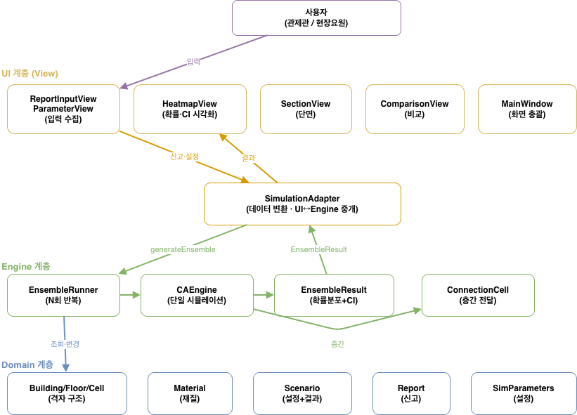

*[그림 2-1] FireWatch 시스템의 전체적인 구조*

위 그림은 시스템의 전체 구조를 데이터 흐름 관점에서 표현한 것이다. 시스템은 UI·Engine·Domain의 세 계층으로 구성되며, 계층 간 의존은 단방향(UI → Engine → Domain)을 유지한다. 데이터 흐름은 두 방향으로 나뉜다.

- **입력 흐름**(아래 방향): 사용자가 신고·설정을 입력하면 View가 수집하여 SimulationAdapter를 통해 Engine으로 전달하고, Engine이 Domain의 건물·재질 데이터를 조회한다.
- **결과 흐름**(위 방향): Engine이 산출한 확률 분포(EnsembleResult)를 Adapter가 받아 View로 전달하고, View가 히트맵·단면·비교로 시각화한다.

SimulationAdapter가 UI와 Engine 사이의 유일한 통로 역할을 하여, 시뮬레이션 로직이 특정 UI 기술에 묶이지 않는다.

다음으로, 시스템을 구성하는 전체 클래스와 그 관계를 한 장에 종합하면 아래 그림과 같다.

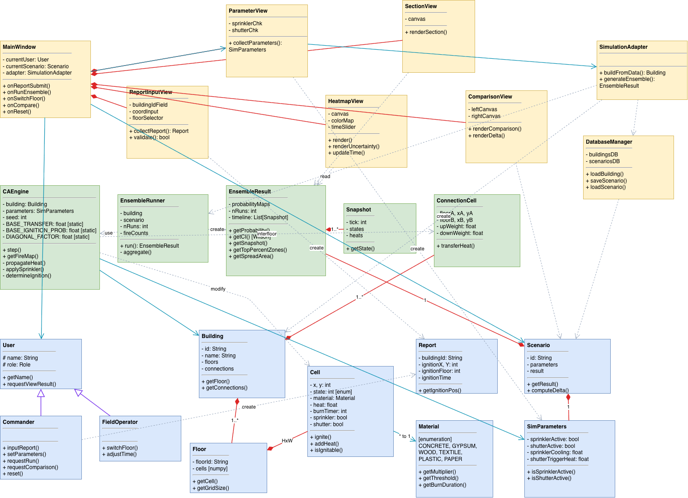

*[그림 2-2] FireWatch 전체 클래스 다이어그램*

위 그림은 23개 클래스와 그 사이의 관계를 한 장에 종합한 것이다. 클래스는 색상으로 계층을 구분한다(파랑: Domain, 초록: Engine, 노랑: UI/Adapter). 관계는 네 종류로 표현된다.

- **일반화(보라색, △)**: 상속 관계. User를 Commander·FieldOperator가 상속한다.
- **합성(빨강, ◆)**: 강한 소유 관계. Building이 Floor를, Floor가 Cell을 소유하는 등 부분이 전체에 종속된다.
- **연관(청록, →)**: 객체를 속성으로 보유하는 관계. Cell이 Material을, CAEngine이 Building을 참조한다.
- **의존(회색, ┄>)**: 일시적 사용 또는 생성 관계. EnsembleRunner가 CAEngine을 사용하고 EnsembleResult를 생성하는 등.

이 종합도는 시스템의 전체 구조를 한눈에 조망하기 위한 것이며, 관계가 다소 복잡하게 얽혀 보일 수 있다. 따라서 아래에서는 각 계층을 개별적으로 분리하여 클래스의 속성·메서드와 관계를 차례로 상세히 설명한다.

---

### 2.2. Domain Layer

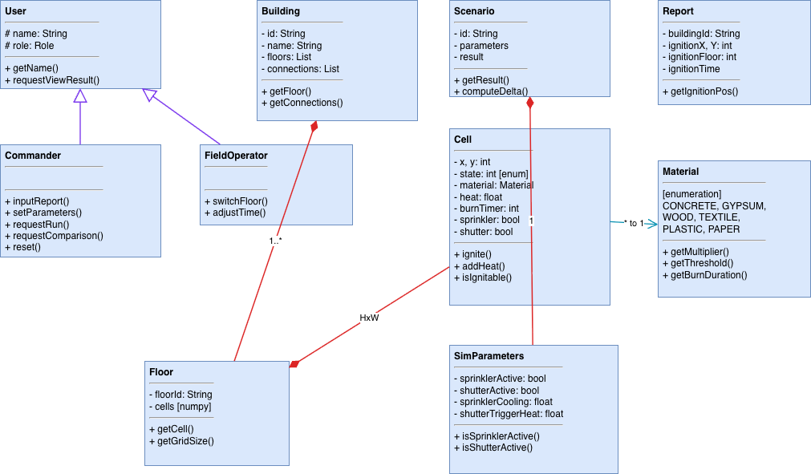

*[그림 2-3] Domain Layer 클래스 다이어그램*

Domain Layer는 사용자·건물·화재 격자·시나리오 등 핵심 개념을 표현하며, 다른 계층에 의존하지 않는 가장 안정적인 계층이다.

#### 2.2.1. User

사용자를 표현하는 클래스. Commander와 FieldOperator의 일반화이며, 결과 조회 기능을 가진다.

| Attributes | 설명 |
|---|---|
| `# name: String` | 사용자 이름 |
| `# role: Role` | 사용자 권한 |

| Methods | 설명 |
|---|---|
| `+ getName(): String` | 이름 반환 |
| `+ requestViewResult(): void` | 결과 조회 요청 |

#### 2.2.2. Commander

관제관 클래스. 모든 제어 권한을 가진다. 실제 엔진 실행은 MainWindow가 트리거하고 Commander는 의도만 표현하여 단방향 의존을 유지한다.

| Attributes | 설명 |
|---|---|
| (없음) | 상위 클래스(User)에서 상속 |

| Methods | 설명 |
|---|---|
| `+ inputReport(r: Report): void` | 신고 입력 |
| `+ setParameters(p: SimParameters): void` | 파라미터 설정 |
| `+ requestRun(): void` | 앙상블 실행 요청 |
| `+ requestComparison(): void` | 비교 요청 |
| `+ reset(): void` | 초기화 |

#### 2.2.3. FieldOperator

현장요원 클래스. 결과 조회와 층 전환·시점 조작만 수행한다.

| Attributes | 설명 |
|---|---|
| (없음) | 상위 클래스(User)에서 상속 |

| Methods | 설명 |
|---|---|
| `+ switchFloor(idx: int): void` | 층 전환 |
| `+ adjustTime(tick: int): void` | 시점 조작 |

#### 2.2.4. Building

건물 클래스. 여러 Floor와 ConnectionCell을 합성으로 소유한다.

| Attributes | 설명 |
|---|---|
| `- id: String` | 건물 식별자 |
| `- name: String` | 건물 이름 |
| `- floors: List<Floor>` | 층 리스트 |
| `- connections: List<ConnectionCell>` | 층간 연결 |

| Methods | 설명 |
|---|---|
| `+ getFloor(idx: int): Floor` | 층 반환 |
| `+ getConnections(): List` | 연결 반환 |

#### 2.2.5. Floor

층 클래스. 격자 형태의 Cell들로 구성된다. 개념적으로는 Cell 객체의 2차원 배열이지만, 실제 구현에서는 성능(벡터화)을 위해 상태·열량·재질을 각각 numpy 배열로 관리한다.

| Attributes | 설명 |
|---|---|
| `- floorId: String` | 층 식별자 (예: "B1", "1F") |
| `- cells: Cell[H][W]` | 격자 셀 배열 «구현은 numpy 배열» |

| Methods | 설명 |
|---|---|
| `+ getCell(x: int, y: int): Cell` | 셀 반환 |
| `+ getGridSize(): (int, int)` | 격자 크기 |

#### 2.2.6. Cell

격자 셀 클래스(1m × 1m). UML 상에서는 개념적 이해를 위해 독립 클래스로 표현했으나, 실제 구현에서는 immutable value object가 아니라 Floor의 numpy 배열의 한 원소(상태 레코드)로 표현되어 벡터화 연산의 대상이 된다. `state`는 EMPTY·BURNING·BURNED·BLOCKED 네 상태의 열거형 의미이며, 구현에서는 성능을 위해 정수(0~3)로 표현한다(Material과 동일).

| Attributes | 설명 |
|---|---|
| `- x, y: int` | 좌표 |
| `- state: int` | 상태 (EMPTY/BURNING/BURNED/BLOCKED) |
| `- material: Material` | 재질 |
| `- heat: float` | 누적 열량 |
| `- burnTimer: int` | 연소 경과 tick |
| `- sprinkler: bool` | 스프링클러 설치 여부 |
| `- shutter: bool` | 방화셔터 설치 여부 |

| Methods | 설명 |
|---|---|
| `+ ignite(): void` | 발화 |
| `+ addHeat(amount: float): void` | 열 누적 |
| `+ isIgnitable(): bool` | 발화 가능 판정 (heat ≥ threshold) |

#### 2.2.7. Material «enum»

셀의 재질을 표현하는 열거형. 6종(CONCRETE, GYPSUM, WOOD, TEXTILE, PLASTIC, PAPER)을 가지며, 각 재질은 물성을 제공한다.

| Enum Values | 설명 |
|---|---|
| `CONCRETE` | 콘크리트 |
| `GYPSUM` | 석고보드 |
| `WOOD` | 목재 (기본값) |
| `TEXTILE` | 직물·카펫 |
| `PLASTIC` | 플라스틱 |
| `PAPER` | 종이 |

| Methods | 설명 |
|---|---|
| `+ getMultiplier(): float` | 발화 확률 배수 |
| `+ getThreshold(): float` | 발화 임계 heat |
| `+ getBurnDuration(): int` | 연소 지속 tick |

#### 2.2.8. Report

화재 신고를 표현. 발화 위치·시각을 가지며 시뮬레이션의 입력이 된다.

| Attributes | 설명 |
|---|---|
| `- buildingId: String` | 건물 식별자 |
| `- ignitionX, Y: int` | 발화 좌표 |
| `- ignitionFloor: int` | 발화 층 |
| `- ignitionTime: DateTime` | 발화 시각 |

| Methods | 설명 |
|---|---|
| `+ getIgnitionPos(): (int, int, int)` | 발화 위치 반환 |

#### 2.2.9. Scenario

하나의 SimParameters와 그 결과 EnsembleResult를 묶는 단위. 시나리오 비교의 단위가 된다.

| Attributes | 설명 |
|---|---|
| `- id: String` | 식별자 |
| `- parameters: SimParameters` | 설정 |
| `- result: EnsembleResult` | 결과 |

| Methods | 설명 |
|---|---|
| `+ getResult(): EnsembleResult` | 결과 반환 |
| `+ computeDelta(other: Scenario): float[][]` | 셀별 확률 차이(Δ) |

#### 2.2.10. SimParameters

시뮬레이션 파라미터. 소방 설비 작동 여부를 boolean으로 가진다.

| Attributes | 설명 |
|---|---|
| `- sprinklerActive: bool` | 스프링클러 작동 여부 |
| `- shutterActive: bool` | 방화셔터 작동 여부 |
| `- sprinklerCooling: float` | 스프링클러 작동 시 heat 감소량 |
| `- shutterTriggerHeat: float` | 방화셔터 작동 임계 heat |

| Methods | 설명 |
|---|---|
| `+ isSprinklerActive(): bool` | 스프링클러 작동 여부 반환 |
| `+ isShutterActive(): bool` | 방화셔터 작동 여부 반환 |

---

### 2.3. Engine Layer

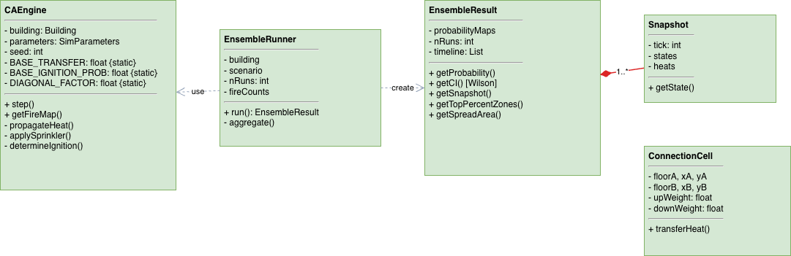

*[그림 2-4] Engine Layer 클래스 다이어그램*

Engine Layer는 확률적 셀룰러 오토마타 시뮬레이션의 핵심 로직을 담당하며, Domain의 데이터를 입력받아 확률 분포 형태의 결과를 산출한다.

#### 2.3.1. CAEngine

단일 회차의 시뮬레이션을 수행하는 엔진으로, 본 시스템의 물리 모델이 집약된 핵심 클래스다. 셀룰러 오토마타 방식에 따라, `step()` 한 번이 1 tick(1초)의 화재 확산을 계산한다. step()은 내부적으로 ①BURNING 셀이 이웃 8방향으로 heat를 방출(대각선은 1/√2로 보정)하는 heat 전달, ②스프링클러 작동 시 heat 감소, ③누적 heat가 재질 임계값을 넘으면 확률적으로 발화시키는 발화 결정, ④연소 시간이 지난 셀을 BURNED로 전이시키는 단계 등으로 구성된다. 동일 입력이라도 seed에 따라 발화 결과가 달라지는데, 이 확률적 발화가 관측 불가능한 변수에 대한 정보 부족을 표현하는 장치다. BASE_TRANSFER 등의 계수는 모든 인스턴스가 공유하는 상수({static})로, 구체 수치는 Implementation 단계에서 확정한다.

| Attributes | 설명 |
|---|---|
| `- building: Building` | 대상 건물 |
| `- parameters: SimParameters` | 설정 |
| `- seed: int` | 난수 시드 |
| `- BASE_TRANSFER: float {static}` | 기본 heat 전달 계수 |
| `- BASE_IGNITION_PROB: float {static}` | 기본 발화 확률 계수 |
| `- DIAGONAL_FACTOR: float {static}` | 대각선 보정 (1/√2, 수학적 상수) |

| Methods | 설명 |
|---|---|
| `+ step(): void` | 단일 tick 시뮬레이션 (6단계) |
| `+ getFireMap(floor: int): float[][]` | 발화 맵 반환 |
| `- propagateHeat(): void` | 8방향 heat 전달 (대각선 보정) |
| `- applySprinkler(): void` | 스프링클러 처리 |
| `- determineIgnition(): void` | 확률적 발화 결정 |

#### 2.3.2. EnsembleRunner

CAEngine을 동일 조건으로 N회 반복 호출하여 도달 확률 분포를 산출하는 클래스로, 본 시스템의 설계 철학(인식론적 결정론과 확률적 샘플링)을 직접 구현하는 부분이다. 단일 CAEngine 실행은 하나의 가능한 시나리오만 보여주지만, EnsembleRunner는 매 회차마다 다른 seed로 CAEngine을 반복 실행하여 "정보가 불완전한 상황에서 일어날 수 있는 다양한 확산 경향"을 표본으로 수집한다. 각 셀이 N회 중 몇 번 발화했는지(fireCounts)를 누적한 뒤, 이를 확률로 환산하여 EnsembleResult로 종합한다. 이 구조는 기상 앙상블 예측이 여러 초기조건으로 다수 시뮬레이션을 돌려 확률 예보를 만드는 방식과 동일한 원리다.

| Attributes | 설명 |
|---|---|
| `- building: Building` | 대상 건물 |
| `- scenario: Scenario` | 설정 |
| `- nRuns: int` | 앙상블 회차 수 |
| `- fireCounts: int[][][]` | 층·셀별 누적 점화 카운트 |

| Methods | 설명 |
|---|---|
| `+ run(maxTicks: int): EnsembleResult` | N회 실행 후 결과 반환 |
| `- aggregate(): void` | 회차별 결과 합산 |

#### 2.3.3. EnsembleResult

N회 시뮬레이션의 종합 결과를 보유하고, 그로부터 파생되는 모든 해석을 제공하는 클래스다. 확률 분포 조회(getProbability), 신뢰구간 산출(getCI), 시점별 상태 조회(getSnapshot), 상위 위험 구역·확산 면적 등의 통계(getTopPercentZones, getSpreadArea)가 모두 "앙상블 결과의 해석"이라는 단일 책임으로 묶이므로, 응집도를 높이기 위해 이들을 한 클래스에 모았다. 특히 getCI()는 단순 확률값에 더해 그 확률이 얼마나 신뢰할 만한지를 Wilson Score 신뢰구간으로 제공하는데, 이는 본 시스템이 단일 예측이 아닌 "불확실성까지 정량화한 예측"을 지향함을 구조적으로 드러내는 부분이다.

| Attributes | 설명 |
|---|---|
| `- probabilityMaps: float[][][]` | 층·셀별 도달 확률 (0~1) |
| `- nRuns: int` | 앙상블 회차 수 |
| `- timeline: List<Snapshot>` | 시점별 스냅샷 |

| Methods | 설명 |
|---|---|
| `+ getProbability(floor, x, y): float` | 셀별 도달 확률 |
| `+ getCI(floor, x, y): (float, float)` | Wilson Score 신뢰구간 |
| `+ getSnapshot(tick: int): Snapshot` | 특정 시점 상태 |
| `+ getTopPercentZones(floor, pct): List<Cell>` | 상위 N% 위험 구역 |
| `+ getSpreadArea(floor): float` | 화재 확산 면적 |

#### 2.3.4. Snapshot

특정 tick의 격자 상태를 저장하는 값 객체. 사용자가 시간을 되감아 확산 과정을 확인할 수 있게 한다.

| Attributes | 설명 |
|---|---|
| `- tick: int` | 시점 |
| `- states: int[][]` | 셀 상태 배열 |
| `- heats: float[][]` | 열량 배열 |

| Methods | 설명 |
|---|---|
| `+ getState(): int[][]` | 상태 반환 |

#### 2.3.5. ConnectionCell

두 층 사이의 화재 전파 경로(계단·엘리베이터·덕트). 굴뚝 효과를 반영하여 상향 전달 가중치를 하향보다 크게 설정한다.

| Attributes | 설명 |
|---|---|
| `- floorA, xA, yA: int` | 첫 번째 층 연결 위치 |
| `- floorB, xB, yB: int` | 두 번째 층 연결 위치 |
| `- upWeight: float` | 상향 heat 전달 가중치 |
| `- downWeight: float` | 하향 heat 전달 가중치 |

| Methods | 설명 |
|---|---|
| `+ transferHeat(fromFloor: int, heat: float): float` | 방향별 전달량 계산 |

---

### 2.4. UI / Adapter Layer

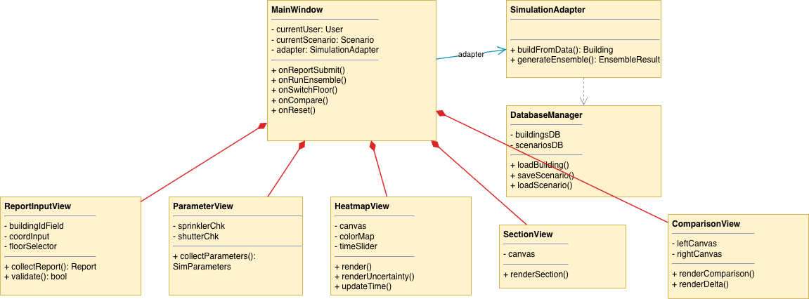

*[그림 2-5] UI / Adapter Layer 클래스 다이어그램*

UI 계층은 사용자 입력 수집과 결과 시각화를 담당하며, SimulationAdapter를 통해 Engine과 통신한다.

#### 2.4.1. MainWindow

전체 화면을 관리하는 중심 클래스. 다섯 개의 View를 합성으로 소유하고, 사용자 동작을 각 View·Engine에 연결한다.

| Attributes | 설명 |
|---|---|
| `- currentUser: User` | 현재 사용자 |
| `- currentScenario: Scenario` | 활성 시나리오 |
| `- adapter: SimulationAdapter` | 엔진 접근 어댑터 |

| Methods | 설명 |
|---|---|
| `+ onReportSubmit(): void` | 신고 제출 핸들러 |
| `+ onRunEnsemble(): void` | 앙상블 실행 핸들러 |
| `+ onSwitchFloor(idx: int): void` | 층 전환 핸들러 |
| `+ onCompare(): void` | 시나리오 비교 핸들러 |
| `+ onReset(): void` | 초기화 핸들러 |

#### 2.4.2. ReportInputView

신고 입력 화면. 입력값을 Report 객체로 생성한다.

| Attributes | 설명 |
|---|---|
| `- buildingIdField: QLineEdit` | 건물 식별자 입력 |
| `- coordInput: QWidget` | 좌표 입력 |
| `- floorSelector: QComboBox` | 층 선택 |

| Methods | 설명 |
|---|---|
| `+ collectReport(): Report` | 신고 생성 |
| `+ validate(): bool` | 유효성 검사 |

#### 2.4.3. ParameterView

파라미터 설정 화면. 스프링클러·방화셔터 작동 여부를 입력받아 SimParameters를 생성한다.

| Attributes | 설명 |
|---|---|
| `- sprinklerChk: QCheckBox` | 스프링클러 체크박스 |
| `- shutterChk: QCheckBox` | 방화셔터 체크박스 |

| Methods | 설명 |
|---|---|
| `+ collectParameters(): SimParameters` | 설정 생성 |

#### 2.4.4. HeatmapView

결과 시각화의 핵심 화면으로, 본 시스템의 차별점인 불확실성 시각화를 담당한다. 단순히 셀별 도달 확률을 색상 그라데이션으로 표시하는 데 그치지 않고, renderUncertainty()를 통해 신뢰구간의 폭을 해칭(빗금) 패턴으로 함께 표현한다. 이로써 확률값이 동일하더라도 그 확률이 통계적으로 안정적인 영역과 표본에 따라 크게 흔들리는 불확실한 경계 영역을 사용자가 시각적으로 구분할 수 있다. 즉 "어디가 위험한가"뿐 아니라 "그 판단을 얼마나 신뢰할 수 있는가"까지 한 화면에 전달하여, 의사결정자가 주의를 집중해야 할 경계 영역을 직관적으로 인지하도록 돕는다. timeSlider와 연동되어 Control Time(UC7) 시 특정 시점의 분포로 갱신된다.

| Attributes | 설명 |
|---|---|
| `- canvas: QWidget` | 렌더링 영역 |
| `- colorMap: ColorMap` | 색상 맵 |
| `- timeSlider: QSlider` | 시점 조작 |

| Methods | 설명 |
|---|---|
| `+ render(result: EnsembleResult, floor: int): void` | 히트맵 렌더링 |
| `+ renderUncertainty(ci: float[][]): void` | CI 폭 기반 해칭 |
| `+ updateTime(tick: int): void` | 시점 변경 시 갱신 |

#### 2.4.5. SectionView

다층 건물의 수직 단면을 통해 층간 화재 확산을 시각화한다.

| Attributes | 설명 |
|---|---|
| `- canvas: QWidget` | 렌더링 영역 |

| Methods | 설명 |
|---|---|
| `+ renderSection(result: EnsembleResult): void` | 단면 렌더링 |

#### 2.4.6. ComparisonView

두 시나리오 결과를 나란히 표시하고 셀별 확률 차이(Δ)를 발산형 색상으로 강조한다.

| Attributes | 설명 |
|---|---|
| `- leftCanvas: QWidget` | 좌측 렌더링 영역 |
| `- rightCanvas: QWidget` | 우측 렌더링 영역 |

| Methods | 설명 |
|---|---|
| `+ renderComparison(a: Scenario, b: Scenario): void` | 두 시나리오 비교 |
| `+ renderDelta(delta: float[][]): void` | Δ 발산형 색상 렌더링 |

#### 2.4.7. SimulationAdapter

UI와 Engine 사이의 데이터 변환·함수 시그니처 호환을 담당하는 공개 API.

| Attributes | 설명 |
|---|---|
| (없음) | 상태를 가지지 않는 파사드 클래스 |

| Methods | 설명 |
|---|---|
| `+ buildFromData(buildingId: String): Building` | 데이터로부터 Building 구성 |
| `+ generateEnsemble(building, scenario, nRuns): EnsembleResult` | 앙상블 실행 래퍼 |

#### 2.4.8. DatabaseManager

내부 데이터 저장소와의 통신을 담당. 외부 RDBMS가 아닌 내부 저장소(파일/메모리)를 데이터베이스로 추상화하며, 저장 파일이 데이터베이스의 역할을 수행한다.

| Attributes | 설명 |
|---|---|
| `- buildingsDB: Dict` | 건물 데이터 저장소 |
| `- scenariosDB: Dict` | 시나리오 저장소 |

| Methods | 설명 |
|---|---|
| `+ loadBuilding(id: String): Building` | 건물 조회 |
| `+ saveScenario(s: Scenario): void` | 시나리오 저장 |
| `+ loadScenario(id: String): Scenario` | 시나리오 불러오기 |

---

### 2.5. 계층 간 연결

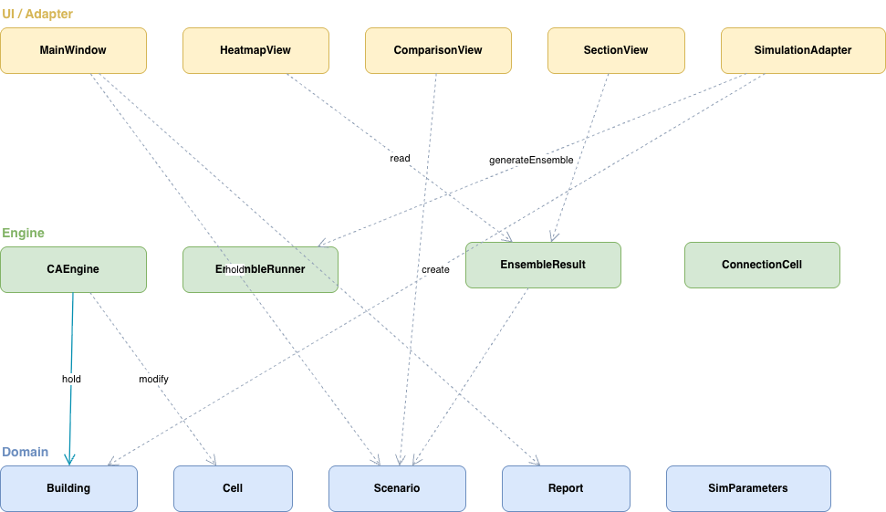

*[그림 2-6] 계층 간 연결 (단방향 의존)*

FireWatch의 계층 간 의존은 단방향(UI → Engine → Domain)을 엄격히 유지한다. 상위 계층은 하위 계층을 알지만, 하위 계층은 상위 계층을 알지 못한다.

- **UI → Engine**: SimulationAdapter가 EnsembleRunner를 호출하여(generateEnsemble) EnsembleResult를 받고, HeatmapView·SectionView가 그 결과를 읽어 시각화한다.
- **UI → Domain**: ReportInputView는 Report를, ParameterView는 SimParameters를 생성한다(«create»). MainWindow는 현재 사용자와 활성 시나리오를 보유한다.
- **Engine → Domain**: CAEngine은 Building·SimParameters를 보유(연관)하고, 시뮬레이션 중 각 Cell의 상태와 heat를 변경한다(의존).

이러한 단방향 구조 덕분에 핵심 계산 로직(Engine)이 특정 UI 기술(PyQt6)에 묶이지 않아, 향후 웹 인터페이스나 배치 분석 도구 등 다른 형태로의 확장이 용이하다.

---

| 관계 | 종류 | 다중성 |
|---|---|---|
| User ← Commander, FieldOperator | 일반화 | - |
| Building ◆— Floor | 합성 | 1..* |
| Floor ◆— Cell | 합성 | H × W |
| Cell —> Material | 연관 | * → 1 |
| Building ◆— ConnectionCell | 합성 | 1..* |
| Scenario ◆— SimParameters | 합성 | 1 |
| Scenario ◆— EnsembleResult | 합성 | 1 |
| EnsembleResult ◆— Snapshot | 합성 | 1..* |
| CAEngine —> Building, SimParameters | 연관 | - |
| EnsembleRunner ┄> CAEngine | 의존 | - |
| EnsembleRunner ┄> EnsembleResult «create» | 의존(생성) | - |
| CAEngine ┄> Cell | 의존(변경) | - |
| CAEngine ┄> ConnectionCell | 의존 | - |
| MainWindow ◆— View들 | 합성 | 1 each |
| MainWindow —> User, Scenario, SimulationAdapter | 연관 | - |
| SimulationAdapter ┄> EnsembleRunner, DatabaseManager | 의존 | - |
| 각 View ┄> Report/SimParameters/EnsembleResult/Scenario | 의존 | - |

## 3. Sequence Diagram

본 장은 Analysis 단계에서 식별한 11개 Use Case에 대해, 객체들이 시간 순서에 따라 주고받는 메시지를 시퀀스 다이어그램으로 표현한다. 각 다이어그램은 해당 Use Case의 주 흐름(Main Success Scenario)을 기준으로 작성하였으며, 실선 화살표는 메시지 호출을, 점선 화살표는 반환을 나타낸다. 참여 객체는 2장의 클래스를 따르며, 색상으로 계층을 구분한다(보라: 액터, 노랑: UI/Adapter, 초록: Engine, 파랑: Domain).

---

### 3.1. Input Report

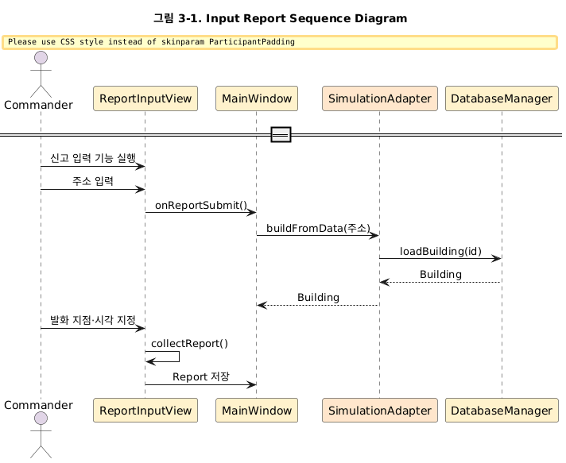

*[그림 3-1] Input Report Sequence Diagram*

위 그림은 관제관이 화재 신고를 입력하는 과정이다. 관제관이 신고 입력 기능을 실행하고 신고받은 주소를 입력하면, ReportInputView가 onReportSubmit()으로 MainWindow에 전달한다. MainWindow는 SimulationAdapter의 buildFromData()를 호출하고, 이는 다시 DatabaseManager의 loadBuilding()을 통해 해당 건물 데이터를 가져온다(Load Building, UC2). 건물이 로드되면 관제관이 평면도에서 발화 지점과 시각을 지정하고, ReportInputView가 collectReport()로 Report 객체를 생성하여 MainWindow에 저장하며 끝난다.

---

### 3.2. Load Building

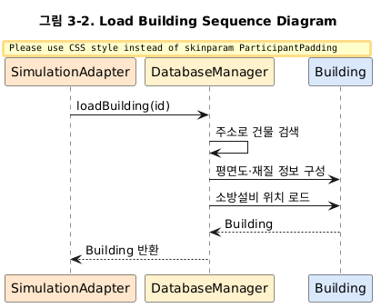)

*[그림 3-2] Load Building Sequence Diagram*

위 그림은 시스템이 건물 데이터를 로드하는 과정이다. SimulationAdapter가 DatabaseManager의 loadBuilding()을 호출하면, DatabaseManager는 입력된 주소로 건물을 검색하고, 해당 건물의 평면도·셀별 재질 정보와 소방 설비 위치 정보를 함께 구성한다. 구성된 Building 객체를 SimulationAdapter에 반환하며 끝난다. 본 Use Case는 Input Report(UC1)의 흐름 안에서 «include»로 호출된다.

---

### 3.3. Set Parameters

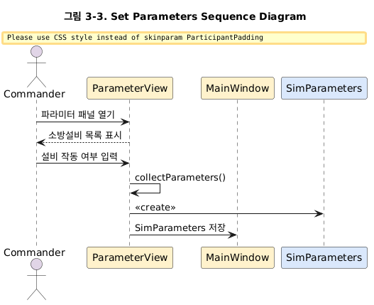)

*[그림 3-3] Set Parameters Sequence Diagram*

위 그림은 관제관이 시뮬레이션 파라미터를 설정하는 과정이다. 관제관이 파라미터 패널을 열면 ParameterView가 현재 건물에 등록된 소방 설비 목록을 표시한다. 관제관이 각 설비(스프링클러, 방화셔터)의 작동 여부를 입력하면, ParameterView가 collectParameters()를 통해 SimParameters 객체를 생성하여 MainWindow에 저장하며 끝난다.

---

### 3.4. Run Ensemble

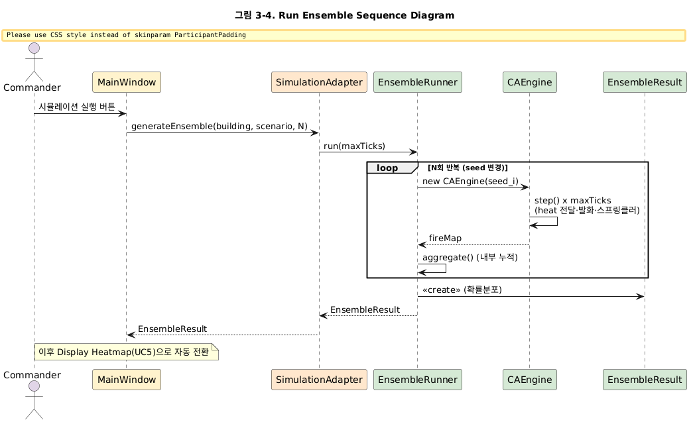)

*[그림 3-4] Run Ensemble Sequence Diagram*

위 그림은 시스템이 앙상블 시뮬레이션을 실행하는 과정으로, 본 시스템의 핵심 흐름이다. 관제관이 시뮬레이션 실행 버튼을 누르면 MainWindow가 SimulationAdapter의 generateEnsemble()을 호출하고, 이는 EnsembleRunner의 run()으로 이어진다. EnsembleRunner는 서로 다른 seed로 N회 반복하며(loop), 매 회차마다 새로운 CAEngine을 생성하여 maxTicks만큼 step()을 수행한다. 각 step()은 heat 전달(8방향, 대각선 보정), 확률적 발화 결정, 스프링클러 처리 등을 포함하는 단일 tick 연산이다. EnsembleRunner는 각 회차의 fireMap 결과를 내부적으로 누적(aggregate)하며, N회 반복이 끝나면 누적된 확률 분포로 EnsembleResult를 생성하여 반환한다. 결과는 SimulationAdapter를 거쳐 MainWindow로 전달된다. 이 서로 다른 seed를 이용한 반복이 정보 부족을 확률적으로 샘플링하는 본 시스템의 핵심 메커니즘이다. 이후 Display Heatmap(UC5)으로 자동 전환된다.

---

### 3.5. Display Heatmap

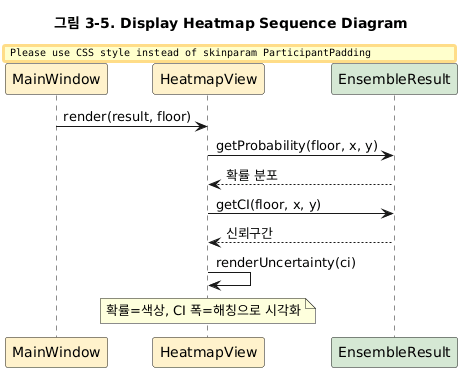)

*[그림 3-5] Display Heatmap Sequence Diagram*

위 그림은 시스템이 결과를 히트맵으로 표시하는 과정이다. MainWindow가 HeatmapView의 render()를 호출하면, HeatmapView는 EnsembleResult로부터 getProbability()로 셀별 도달 확률을, getCI()로 Wilson Score 신뢰구간을 가져온다. 이후 renderUncertainty()를 통해 확률은 색상 그라데이션으로, 신뢰구간 폭은 해칭 패턴으로 시각화하며 끝난다. 이로써 통계적으로 안정적인 영역과 불확실한 경계 영역이 구분되어 표시된다.

---

### 3.6. Switch Floor

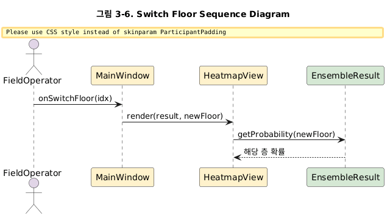)

*[그림 3-6] Switch Floor Sequence Diagram*

위 그림은 사용자가 다른 층의 결과를 확인하는 과정이다. 현장요원이 층 선택 탭에서 층을 선택하면 MainWindow의 onSwitchFloor()가 호출되고, MainWindow는 HeatmapView의 render()를 새 층 인자로 호출한다. HeatmapView는 EnsembleResult에서 해당 층의 확률 분포를 가져와 화면을 갱신하며 끝난다.

---

### 3.7. Control Time

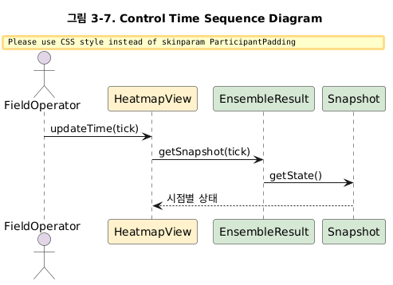)

*[그림 3-7] Control Time Sequence Diagram*

위 그림은 사용자가 특정 시점의 상태를 확인하는 과정이다. 현장요원이 시간 슬라이더를 조작하면 HeatmapView의 updateTime()이 호출되고, HeatmapView는 EnsembleResult의 getSnapshot()으로 해당 시점의 Snapshot을 가져온다. Snapshot의 getState()로 시점별 격자 상태를 받아 화면을 갱신하며 끝난다. 이를 통해 사용자는 시간을 되감아 화재 확산 과정을 단계별로 확인할 수 있다.

---

### 3.8. View Building Section

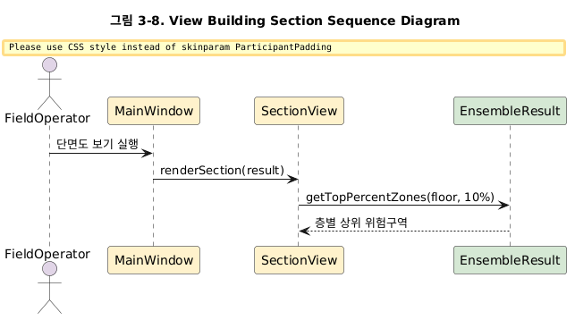)

*[그림 3-8] View Building Section Sequence Diagram*

위 그림은 사용자가 건물 단면도를 확인하는 과정이다. 현장요원이 단면도 보기 기능을 실행하면 MainWindow가 SectionView의 renderSection()을 호출한다. SectionView는 EnsembleResult의 getTopPercentZones()로 각 층별 도달 확률 상위 10% 구역을 가져와, 단면도와 층별 위험도 색상을 화면에 표시하며 끝난다.

---

### 3.9. View Result Summary

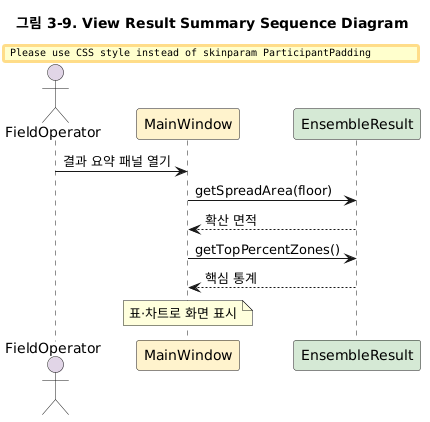)

*[그림 3-9] View Result Summary Sequence Diagram*

위 그림은 사용자가 결과 요약을 확인하는 과정이다. 현장요원이 결과 요약 패널을 열면 MainWindow가 EnsembleResult로부터 getSpreadArea()로 확산 면적을, getTopPercentZones()로 핵심 위험 구역 통계를 가져온다. 계산된 수치들을 표 또는 차트 형태로 화면에 표시하며 끝난다.

---

### 3.10. Compare Scenarios

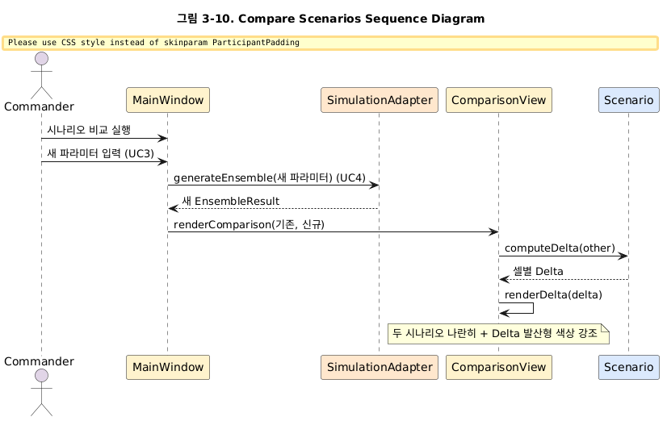)

*[그림 3-10] Compare Scenarios Sequence Diagram*

위 그림은 관제관이 두 시나리오를 비교하는 과정이다. 관제관이 시나리오 비교 기능을 실행하고 새 파라미터를 입력하면(Set Parameters, UC3), MainWindow가 새 파라미터로 generateEnsemble()을 호출하여 시뮬레이션을 재실행한다(Run Ensemble, UC4). 새 EnsembleResult가 반환되면 MainWindow는 ComparisonView의 renderComparison()을 호출하고, ComparisonView는 Scenario의 computeDelta()로 두 결과 간 셀별 확률 차이(Δ)를 계산한다. 이후 renderDelta()를 통해 두 시나리오를 나란히 표시하고 Δ를 발산형 색상으로 강조하며 끝난다. 이 상대 비교가 본 시스템이 제공하는 핵심 의사결정 정보다.

---

### 3.11. Reset Simulation

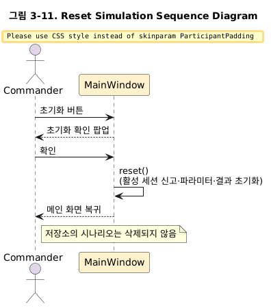

*[그림 3-11] Reset Simulation Sequence Diagram*

위 그림은 관제관이 시뮬레이션을 초기화하는 과정이다. 관제관이 초기화 버튼을 누르면 MainWindow가 초기화 확인 팝업을 띄워 의사를 재확인한다. 관제관이 확인을 누르면 MainWindow가 reset()을 수행하여 현재 활성 세션의 신고 정보·파라미터·시뮬레이션 결과를 초기화하고 메인 화면으로 복귀하며 끝난다. 이때 저장소(DatabaseManager)에 저장된 시나리오는 삭제되지 않으며, 초기화 대상은 현재 작업 중인 세션 상태로 한정된다.
